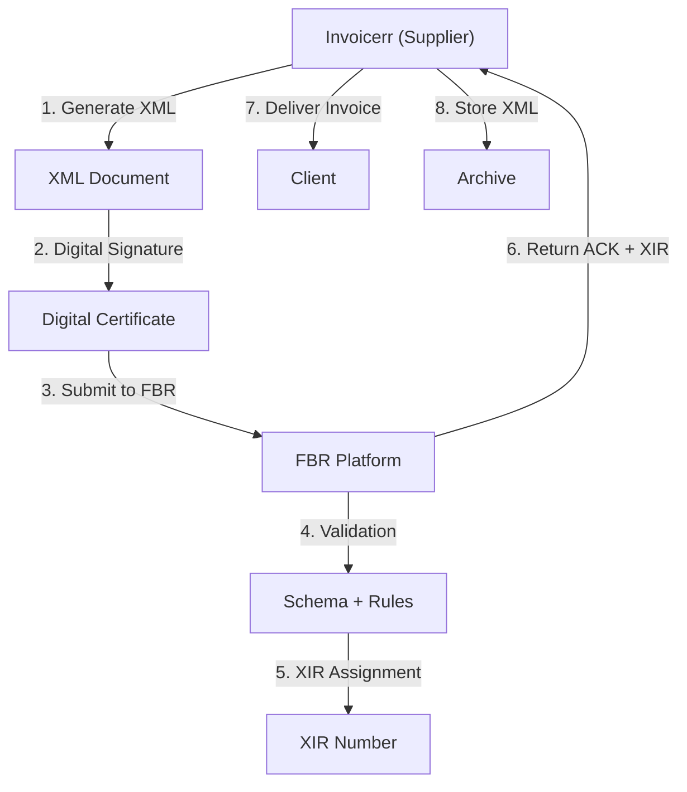

# 🇵🇰 Pakistan - E-Invoicing Specifications (XIR System)

**Status:** 🟢 **Mandatory** | Active for threshold-based taxpayers
**Authority:** FBR (Federal Board of Revenue)
**Platform:** e-Invoice System (XIR)

---

## 1. Context & Overview

Pakistan has mandatory e-invoicing through the FBR. All sales above certain thresholds must be reported through the e-invoice system with XIR (e-Invoice Reference) authorization.

| Date | Scope | Obligation |
| --- | --- | --- |
| **2021+** | Large taxpayers | Progressive mandatory rollout |
| **Ongoing** | Threshold-based | Additional categories included |
| **Current** | Continued expansion | More businesses covered |

---

## 2. Technical Workflow (Clearance Model)

### 🧱 Key Components

1. **STRN (Sales Tax Registration Number):** Tax ID
2. **XIR (e-Invoice Reference):** Unique reference
3. **Digital Certificate:** FBR-approved

---

## 3. Data Standards & Formats

### A. Required Format

- **XML Format:** FBR schema
- **Encoding:** UTF-8
- **Digital Signature:** Required

### B. Document Types

| Type | Description |
| --- | --- |
| **Tax Invoice** | Standard VAT invoice |
| **Adjustment Note** | Credit/Debit notes |

### C. Critical Data Fields

- **STRN:** Tax ID (7-15 digits)
- **XIR:** Unique reference number
- **GST Rate:** 18% standard
- **Invoice Date:** DD/MM/YYYY format

---

## 4. Business Model & Compliance

### A. Workflow

1. **STRN Registration:** Obtain FBR tax ID
2. **Certificate:** Acquire digital certificate
3. **XML Generation:** Create FBR-compliant document
4. **Signing:** Apply electronic signature
5. **Submission:** Send to FBR
6. **XIR:** Receive reference number
7. **Delivery:** Send to buyer

### B. Archiving

- **Retention:** 6 years
- **Format:** Original XML

---

## 5. Implementation Checklist

- [ ] **STRN Registration:** Obtain Pakistani tax ID
- [ ] **Digital Certificate:** Acquire FBR certificate
- [ ] **XML Engine:** Build FBR schema generator
- [ ] **Signature Integration:** Implement signing
- [ ] **FBR API:** Connect to e-Invoice system
- [ ] **XIR Processing:** Handle reference numbers

---

## 6. Resources

- **FBR Portal:** [Fbr.gov.pk](https://www.fbr.gov.pk)
- **e-Invoicing Section:** [FBR XIR](https://sros.fbr.gov.pk/)
