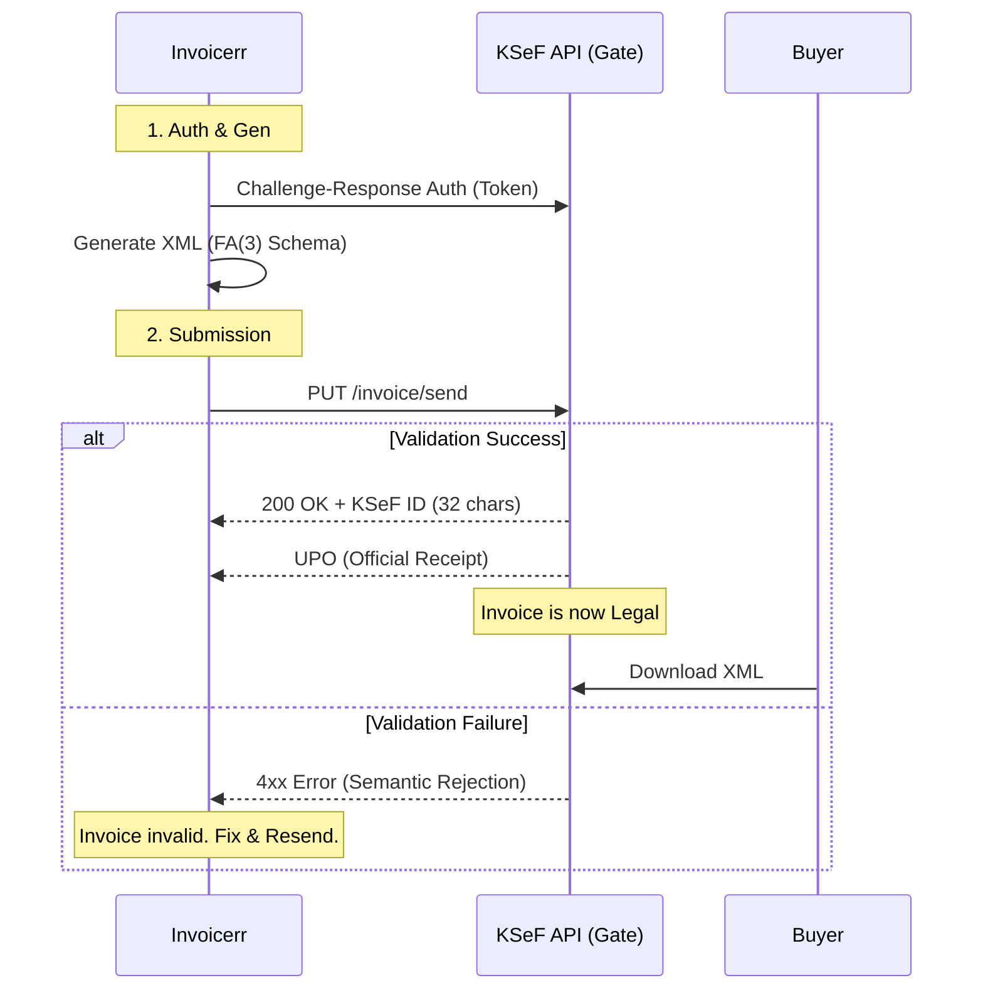

# 🇵🇱 Poland - Invoicing Specifications (KSeF)

**Status:** 🔴 **Mandatory B2B (Feb/Apr 2026)**
**Authority:** Ministry of Finance (KAS)
**Platform:** **KSeF** (National e-Invoicing System)

---

## 1. Context & Roadmap

Poland implements **KSeF 2.0**, one of the strictest Clearance models in Europe.
**Crucial Distinction:**

* **Centralized:** Unlike Belgium/Germany (Peppol), Poland requires a direct connection to the Government API.
* **Legal Invoice:** The PDF is **not** the invoice. The XML residing on the Government server is the only legal invoice.

| Date | Scope | Obligation |
| --- | --- | --- |
| **Feb 1, 2026** | **Large Enterprises** | Mandatory emission for turnover **> 200M PLN** (~€46M). |
| **Apr 1, 2026** | **All Companies** | Mandatory emission for **all B2B** VAT payers. |
| **Jan 1, 2027** | **Micro / Cash** | Extension to simplified invoices (tickets) and micro-businesses. |

---

## 2. Technical Workflow (Direct Clearance)

Invoicerr must act as a "KSeF Client". There is no "send to customer" step; you "send to KSeF", and the customer downloads it from KSeF.

### 🧱 Key Components

1. **KSeF ID:** A 32-character alphanumeric ID assigned by the system upon validation. It is the proof of existence (e.g., `1234567890-20260201-ABCDEF-12`).
2. **UPO (Urzędowe Poświadczenie Odbioru):** An XML receipt signed by the Gov proving the invoice was successfully submitted.
3. **FA(3) Schema:** The logical structure of the invoice. It is **proprietary** to Poland (not UBL).

---

## 3. Data Standards & Visuals

### A. Format: `FA(3)` XML

* **Type:** Logical Structure (Logical Schema).
* **Specs:** Very rich schema including payment terms, settlement roles, and specific tax codes (GTU).
* **Constraint:** Strict semantic validation. If a tax rate is wrong, the API rejects it instantly.

### B. Visualization (PDF & QR Code)

Since the XML is invisible to humans, `invoicerr` must generate a PDF for visualization or "Offline" exchange.

* **Mandatory:** If the invoice is provided outside the system (e.g., to a foreign client or during failure), the PDF **must** contain a KSeF-standardized **QR Code**.
* **QR Content:** Encodes the KSeF ID and verification URL.

---

## 4. Failure Modes (Offline Mode)

If the KSeF API is down or the user has no internet:

1. **Offline Emission:** User generates the XML + PDF with QR Code.
2. **Delivery:** PDF is given to the buyer (who scans the QR).
3. **Regularization:** Invoicerr must upload the XML to KSeF within **1 business day** after connectivity is restored.

---

## 5. Implementation Checklist

* [ ] **KSeF Connector:** Build a direct API connector (REST). Do NOT use the Peppol engine for domestic Poland.
* [ ] **Auth Module:** Implement the specific Challenge-Response authentication (Authorisation Token / e-Seal).
* [ ] **FA(3) Mapper:** Create a mapper to convert internal data to the `FA(3)` XML structure.
* [ ] **KSeF ID Storage:** Database column to store the returned `KSeF ID` and the `UPO` XML.
* [ ] **QR Engine:** Generate the official verification QR Code for the PDF version.
* [ ] **Offline Queue:** Build a background job to retry uploads if the API returns 5xx errors or connection fails.

---

## 6. Resources

* **Official Portal:** [Podatki.gov.pl (KSeF)](https://www.podatki.gov.pl/ksef/)
* **API Swagger (Test):** [KSeF Test Environment](https://www.google.com/search?q=https://ksef-test.mf.gov.pl/api/web/swagger-ui/index.html)
* **Schema FA(3):** [XSD Definitions](https://www.google.com/search?q=https://www.podatki.gov.pl/ksef/pliki-do-pobrania/)