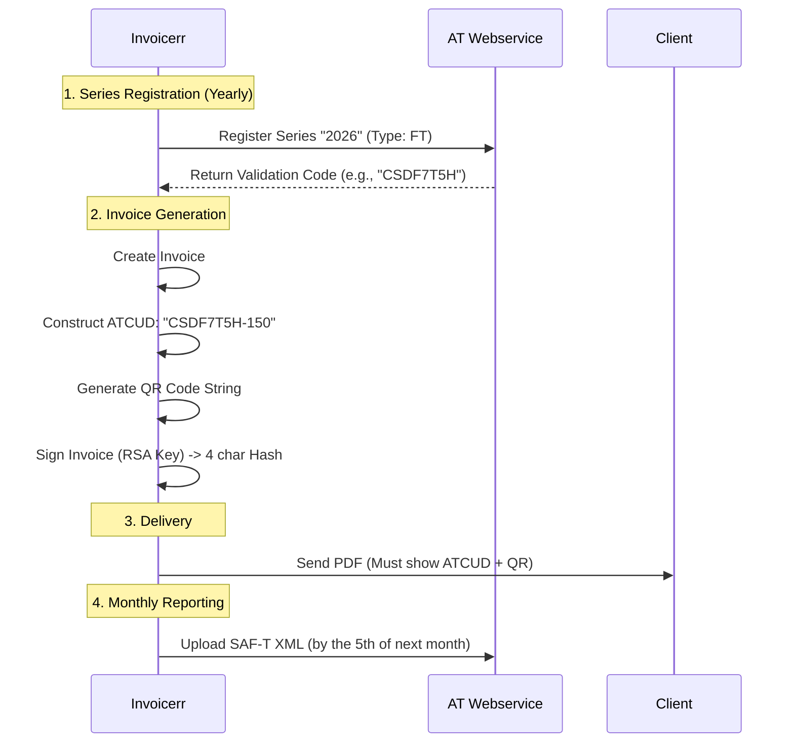

# 🇵🇹 Portugal - Invoicing Specifications (ATCUD / SAF-T)

**Status:** 🔴 **Strict Reporting & Formatting**
**Authority:** AT (Autoridade Tributária e Aduaneira)
**Key Concepts:** **ATCUD**, **QR Code**, **Certified Software**, **SAF-T**.

---

## 1. Context & Roadmap

Portugal uses a **"Smart Invoice"** model. You don't send the invoice to the Gov in real-time (like Italy), but you must embed Gov-issued codes (ATCUD) into the invoice *before* issuing it, and report it monthly via SAF-T.

| Date | Scope | Obligation |
| --- | --- | --- |
| **Active** | **Software** | Billing software must be **certified** by AT (if turnover > €50k). |
| **Active** | **ATCUD** | Mandatory on all invoices (requires pre-registration of series). |
| **Active** | **QR Code** | Mandatory on all PDF/Paper invoices. |
| **Jan 1, 2026** | **B2G** | Mandatory e-invoicing (CIUS-PT) for **ALL** companies (including SMEs). |
| **Jan 1, 2027** | **Digital Sig** | Qualified Electronic Signature (QES) mandatory for PDF invoices. |

---

## 2. Technical Workflow (The ATCUD Cycle)

To issue a valid invoice, Invoicerr must "reserve" a series of numbers with the Tax Authority first.

### 🧱 Key Components

1. **ATCUD:** The unique document code. Format: `ValidationCode-SequentialNumber`.
2. **Validation Code:** Obtained via API (`RegistarSerie`) for each document type and series (e.g., "Invoices 2026").
3. **QR Code:** Contains the full fiscal data of the invoice. Mandatory on the PDF.
4. **Chained Hash:** Each invoice signature relies on the previous invoice's hash.

---

## 3. Data Standards & Visuals

### A. ATCUD Placement

* **Location:** Must be printed on **every page**.
* **Position:** Immediately above the QR Code on the first page.
* **Format:** Readable text (e.g., `ATCUD:CSDF7T5H-150`).

### B. QR Code Content

* **Dimensions:** Min 30x30mm.
* **Data:** A long string with field tags (A: Seller NIF, B: Buyer NIF, H: ATCUD, I1: Tax Base, etc.).
* **Generators:** Must be generated at the moment of issuance, using finalized data.

### C. SAF-T (PT)

* **Format:** XML standard (Billing SAF-T).
* **Frequency:** Monthly (by the 5th).
* **Validation:** AT checks if the ATCUDs in the SAF-T match the registered series.

---

## 4. Certification (Software Certificado)

Invoicerr **cannot** just generate PDFs. To operate in Portugal, the software billing module **must be certified** by the AT.

* **Requirement:** The software is assigned a number (e.g., 1234).
* **Constraint:** You cannot delete invoices. You must issue Credit Notes.
* **Encryption:** Must implement RSA signing for the "4-char Hash" printed on the invoice.

---

## 5. Implementation Checklist

* [ ] **Series Management:** Build a UI to let users "Open a New Series" (calls AT API to get Validation Code).
* [ ] **ATCUD Engine:** Concatenate `ValidationCode` + `InvoiceNumber` and print it on the PDF.
* [ ] **QR Generator:** Map invoice fields to the Portuguese QR string spec and render it.
* [ ] **Chaining Logic:** Ensure Invoice N stores the hash of Invoice N-1.
* [ ] **SAF-T Export:** Build an exporter that generates the monthly SAF-T XML file for the user to upload.
* [ ] **B2G (CIUS-PT):** For public clients, export UBL 2.1 (CIUS-PT profile) instead of PDF.

---

## 6. Resources

* **Portal:** [Portal das Finanças](https://www.portaldasfinancas.gov.pt/)
* **Technical Specs:** [Comunicação de Séries (ATCUD)](https://www.google.com/search?q=https://info.portaldasfinancas.gov.pt/pt/apoio_contribuinte/Faturacao/Comunicacao_Series/Pages/default.aspx)
* **QR Code Specs:** [Especificações Técnicas Código QR](https://www.google.com/search?q=https://info.portaldasfinancas.gov.pt/pt/apoio_contribuinte/novas_regras_faturacao/Pages/default.aspx)