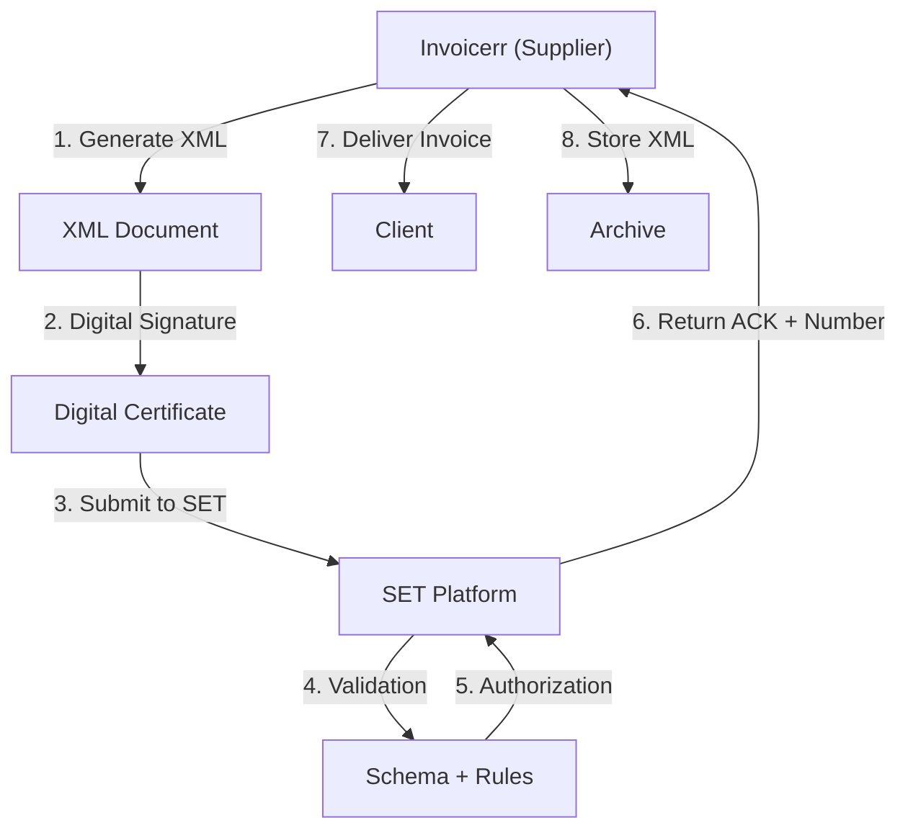

# 🇵🇾 Paraguay - E-Invoicing Specifications (Factura Electrónica)

**Status:** 🟢 **Mandatory** | Active for all businesses
**Authority:** SET (Secretaría de Estado de Tributación)
**Platform:** SET Electronic Invoice System

---

## 1. Context & Overview

Paraguay has mandatory e-invoicing (factura electrónica) through SET. The system follows a **Clearance Model** requiring pre-authorization. Progressive rollout began in 2018.

| Date | Scope | Obligation |
| --- | --- | --- |
| **2018+** | Progressive | Initial rollout by sector |
| **Ongoing** | All businesses | Continuous SET authorization |
| **Current** | Full mandatory | All transaction types |

---

## 2. Technical Workflow (Clearance)

### 🧱 Key Components

1. **RUC (Registro Único de Contribuyente):** Tax ID
2. **Digital Certificate:** SET-approved

---

## 3. Data Standards & Formats

### A. Required Format

- **XML Format:** SET national schema
- **Encoding:** UTF-8
- **Digital Signature:** Required

### B. Document Types

| Code | Type | Description |
| --- | --- | --- |
| **01** | Factura | Invoice |
| **03** | Nota Débito | Debit note |
| **04** | Nota Crédito | Credit note |
| **05** | Guía de Remisión | Transport guide |

### C. Critical Data Fields

- **RUC:** Tax ID (8-9 digits)
- **IVA (IVA):** VAT (10%)
- **Número Autorización:** Authorization number

---

## 4. Business Model & Compliance

### A. Workflow

1. **RUC Registration:** Obtain Paraguayan tax ID
2. **Certificate:** Acquire SET digital certificate
3. **XML Generation:** Create schema-compliant document
4. **Signing:** Apply electronic signature
5. **Submission:** Send to SET
6. **Delivery:** Send to buyer

### B. Archiving

- **Retention:** 5 years
- **Format:** Original XML

---

## 5. Implementation Checklist

- [ ] **RUC Registration:** Obtain Paraguayan tax ID
- [ ] **Digital Certificate:** Acquire SET certificate
- [ ] **XML Engine:** Build SET schema generator
- [ ] **Signature Integration:** Implement signing
- [ ] **SET API:** Connect to web services

---

## 6. Resources

- **SET Portal:** [Set.gov.py](https://www.set.gov.py)
