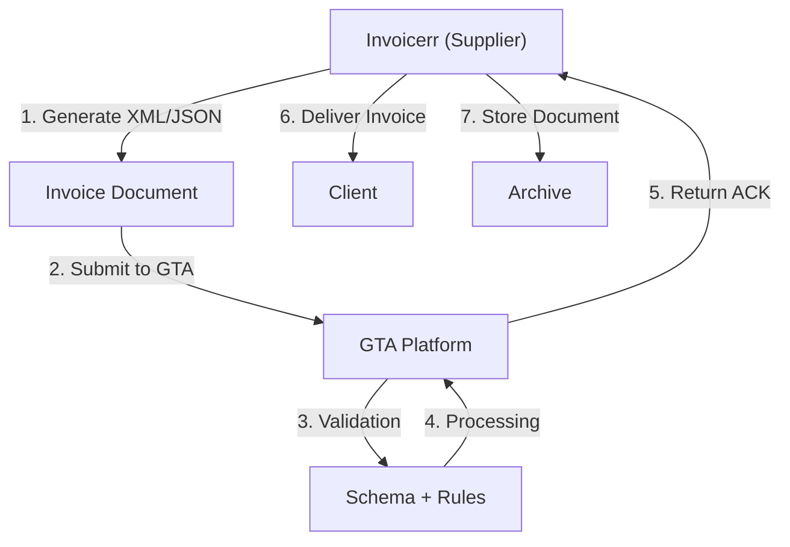

# 🇶🇦 Qatar - E-Invoicing Specifications (GTA e-Invoice)

**Status:** 🟢 **Mandatory** | Active for all businesses
**Authority:** GTA (General Tax Authority)
**Platform:** e-Invoice System

---

## 1. Context & Overview

Qatar has implemented mandatory e-invoicing through the GTA. The system requires real-time invoice reporting for VAT purposes.

| Date | Scope | Obligation |
| --- | --- | --- |
| **2021+** | All businesses | Mandatory e-invoicing |
| **Ongoing** | Continuous | Real-time reporting |

---

## 2. Technical Workflow (Clearance Model)

### 🧱 Key Components

1. **TIN (Tax Identification Number):** Tax ID
2. **GTA Registration:** Required
3. **Invoice Format:** XML/JSON

---

## 3. Data Standards & Formats

### A. Required Format

- **XML/JSON Format:** National schema
- **Encoding:** UTF-8
- **Digital Signature:** Required

### B. Document Types

| Type | Description |
| --- | --- |
| **Tax Invoice** | Standard VAT invoice |
| **Simplified Invoice** | B2C invoices |
| **Credit/Debit Note** | Adjustments |

### C. Critical Data Fields

- **TIN:** Tax ID
- **VAT Rate:** 0% / 15%
- **Invoice Number:** Unique identifier
- **Timestamp:** ISO 8601 format

---

## 4. Business Model & Compliance

### A. Workflow

1. **TIN Registration:** Obtain Qatari tax ID
2. **GTA Registration:** Register on platform
3. **Document Generation:** Create invoice
4. **Submission:** Send to GTA
5. **Delivery:** Send to buyer

### B. Archiving

- **Retention:** 6 years
- **Format:** Original document

---

## 5. Implementation Checklist

- [ ] **TIN Registration:** Obtain Qatari tax ID
- [ ] **GTA Registration:** Register on platform
- [ ] **API Integration:** Connect to e-Invoice system
- [ ] **Document Types:** Support all types

---

## 6. Resources

- **GTA Portal:** [Tax.gov.qa](https://www.tax.gov.qa)
