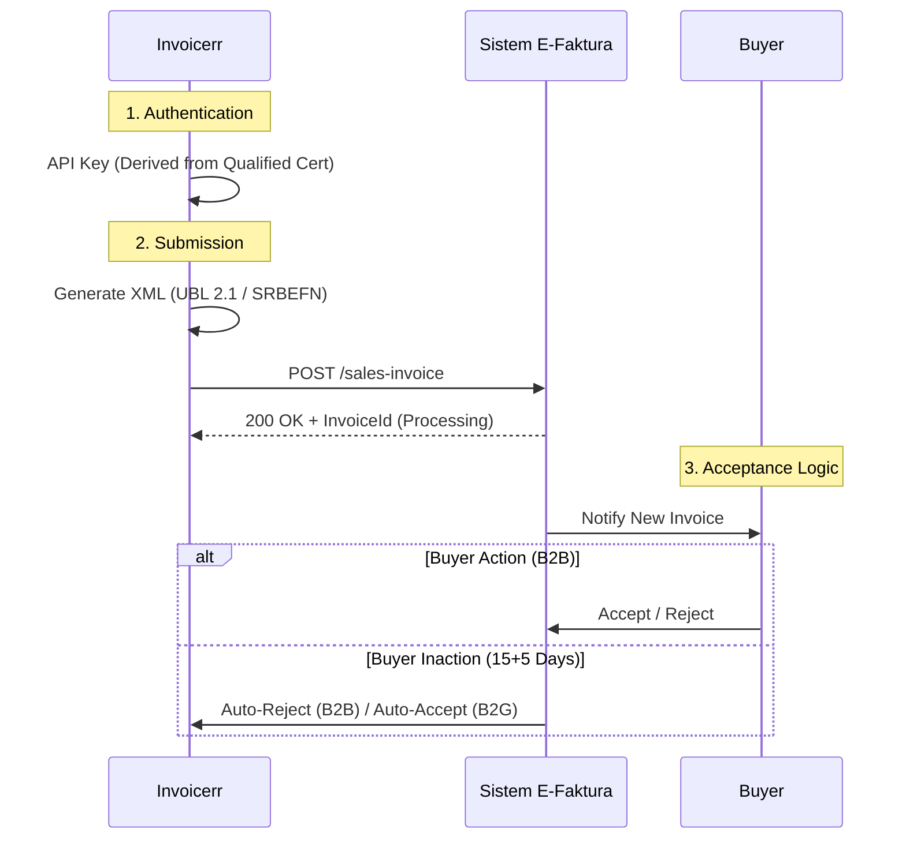

# 🇷🇸 Serbia - Invoicing Specifications (SEF / E-Faktura)

**Status:** 🔴 **Mandatory Clearance (B2B / B2G)**
**Authority:** Ministry of Finance (Poreska uprava)
**Platform:** **SEF** (Sistem E-Faktura)

---

## 1. Context & Roadmap

Serbia operates a centralized Clearance system. The SEF platform is the mandatory hub for all invoice exchange.
**Crucial Rule:** Invoices not issued via SEF are legally void.

| Date | Scope | Obligation |
| --- | --- | --- |
| **Active** | **B2G** | Mandatory since May 2022. |
| **Active** | **B2B** | Mandatory since Jan 2023. |
| **Jan 1, 2026** | **Logistics** | e-Delivery Note (**e-Otpremnica**) mandatory for B2G & Excise goods. |
| **Apr 1, 2026** | **Internal** | Internal invoices (e.g., self-use) must be reported to SEF. |
| **Jan 1, 2027** | **VAT** | Pre-filled VAT return implementation. |

---

## 2. Technical Workflow (Clearance Hub)

The SEF acts as a "hub". You send the invoice to SEF; SEF validates it and makes it available to the buyer.

### 🧱 Key Components

1. **SRBEFN (CIUS):** The Serbian implementation of UBL 2.1.
2. **JBKJS (Public User Number):** A unique ID for public entities. Mandatory for B2G.
3. **API Key:** Generated via the SEF Portal using a Qualified Electronic Certificate (e.g., Halcom/MUP).
4. **Auto-Rejection (B2B):** If a B2B buyer ignores the invoice for 20 days (15+5), it is automatically **REJECTED**.
5. **Auto-Acceptance (B2G):** If a B2G buyer ignores the invoice for 15 days, it is automatically **ACCEPTED**.

---

## 3. Data Standards & Requirements

### A. Format: `UBL 2.1` (SRBEFN)

* **Structure:** Standard UBL.
* **CustomizationID:** Must be `urn:mfin.gov.rs:srbefn:2021`.
* **Delivery Date:** `ActualDeliveryDate` is mandatory and cannot be in the future.

### B. Tax Categories

* `S` (Standard 20%).
* `AE` (Reverse Charge) - Must include exemption reason code.
* `Z` (Zero-rated / Export).
* `OE` (Out of Scope).

---

## 4. Transmission & Acceptance

* **B2B Logic:** The system is "active". The buyer must accept the invoice on the portal for it to be fully valid for VAT deduction. If they sleep, the invoice dies (Rejected).
* **B2G Logic:** Silence implies consent (Accepted).

---

## 5. Implementation Checklist

* [ ] **API Connector:** Build the REST client for `efaktura.mfin.gov.rs`.
* [ ] **JBKJS Field:** Add a specific field for Public Sector clients to input their JBKJS number.
* [ ] **Status Loop:** Implement a robust status checker. You need to know if the invoice was "Accepted", "Rejected", or "Auto-Rejected".
* [ ] **Tax Mapping:** Map internal tax rates to SRBEFN codes (S, AE, Z, etc.).
* [ ] **Delivery Note (Future):** Prepare for `DespatchAdvice` XML for 2026 mandates.

---

## 6. Resources

* **Official Portal:** [Sistem E-Faktura](https://efaktura.mfin.gov.rs/)
* **Demo Environment:** [SEF Demo](https://www.google.com/search?q=https://demo.efaktura.mfin.gov.rs/)
* **Technical Specs:** [Internal Technical Instructions](https://www.google.com/search?q=https://www.efaktura.gov.rs/tekst/511/instrukcije-i-uputstva.php)
