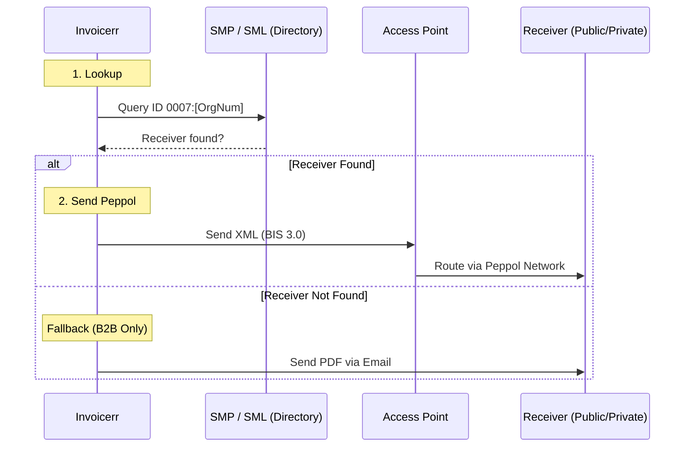

# 🇸🇪 Sweden - Invoicing Specifications (Peppol / SFTI)

**Status:** 🔴 **Mandatory B2G** | 🟡 **Voluntary B2B** (De facto standard)
**Authority:** Digg (Agency for Digital Government) / SFTI (Single Face To Industry)
**Standard:** **Peppol BIS Billing 3.0**

---

## 1. Context & Roadmap

Sweden is a mature e-invoicing market transitioning from legacy formats to EU standards.
**Crucial Distinction:**

* **B2G:** Mandatory for all suppliers to the public sector (since Apr 2019). PDF is banned.
* **B2B:** Voluntary, but major companies require it. Legacy formats (Svefaktura) are being phased out.

| Date | Scope | Obligation |
| --- | --- | --- |
| **Active** | **B2G** | **Mandatory emission** (Law 2018:1277). Must use Peppol BIS 3.0. |
| **Active** | **B2B** | Voluntary. "Soft Mandate" by large buyers. |
| **Jul 1, 2025** | **Legacy** | SFTI withdrew support for Svefaktura. Peppol BIS 3.0 is the only recommended standard. |
| **~2030** | **B2B** | Likely alignment with EU ViDA. |

---

## 2. Technical Workflow (Peppol Only)

Sweden relies entirely on the **Peppol Network**. There is no central government platform for clearing; Digg regulates the network.

### 🧱 Key Components

1. **Peppol BIS Billing 3.0:** The only standard. (Svefaktura is obsolete).
2. **Digg:** The Peppol Authority. They certify Access Points.
3. **Peppol Directory:** Public "Yellow Pages" to find receivers.

---

## 3. Data Standards & Identifiers

### A. Identifiers (ICD 0007)

* **Organization Number:** 10 digits (e.g., `5560123456`).
* **Peppol Scheme:** **`0007`**.
* *Correct Endpoint ID:* `0007:5560123456`.

* **Validation (SE-R-013):** The Org Number **must** pass the **Luhn Algorithm** check. If it fails, the invoice is rejected.

### B. Critical Fields

* **VAT ID format:** `SE` + 10 digits + `01` (e.g., `SE556012345601`).
* **Bank Account:** Swedish companies often use **Bankgiro** or **Plusgiro**. These should be mapped to `cac:PayeeFinancialAccount`.
* **Buyer Reference:** Mandatory for B2G. Usually a "Reference Code" (e.g., `ZZ123`) provided by the buyer.

---

## 4. Implementation Checklist

* [ ] **Peppol Engine:** Use standard Peppol BIS 3.0. Remove any "Svefaktura" export options if you had them.
* [ ] **Luhn Check:** Implement a Luhn Algorithm validator for the Client's Organization Number input field.
* [ ] **Prefix Logic:** Hardcode `0007` prefix for Swedish clients in the Peppol address builder.
* [ ] **Reference Field:** Force the user to input a "Buyer Reference" if the client is a Swedish Public Entity.
* [ ] **Bankgiro Support:** Allow users to input a Bankgiro number (BG) in the bank details section.

---

## 5. Resources

* **Official Authority:** [Digg (E-handel)](https://www.digg.se/)
* **Technical Standards:** [SFTI (Single Face To Industry)](https://sfti.se/)
* **Validator:** [SFTI Validator](https://www.google.com/search?q=https://sfti.se/service/validator)
* **Peppol Directory:** [Directory Lookup](https://directory.peppol.eu)
