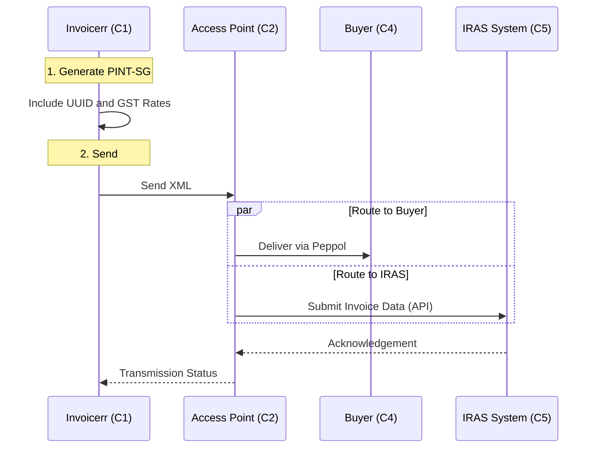

# 🇸🇬 Singapore - Invoicing Specifications (InvoiceNow / PINT-SG)

**Status:** 🔴 **Mandatory Clearance** (Phased: Voluntary new registrants in 2026)
**Authority:** IRAS (Inland Revenue Authority of Singapore) / IMDA
**Standard:** **Peppol PINT-SG**

---

## 1. Context & Roadmap

Singapore is moving to a **5-Corner Model** where data is transmitted to IRAS concurrently with the buyer.
**Crucial Distinction:**

* **InvoiceNow:** The national e-invoicing network (Peppol).
* **GST InvoiceNow Requirement:** The mandate for GST-registered businesses to transmit invoice data to IRAS via InvoiceNow.

| Date | Scope | Obligation |
| --- | --- | --- |
| **Nov 1, 2025** | **New GST Registrants** | Mandatory for newly incorporated companies registering for GST voluntarily. |
| **Apr 1, 2026** | **Voluntary Registrants** | Mandatory for ALL new voluntary GST registrants. |
| **Future** | **All Businesses** | Progressive rollout expected for remaining businesses. |

---

## 2. Technical Workflow (5-Corner Model)

Invoicerr connects to an Access Point, which forks the data to the Buyer (C4) and IRAS (C5).

### 🧱 Key Components

1. **PINT-SG:** The Singaporean Peppol format (based on PINT).
2. **UEN (Unique Entity Number):** The business identifier.
3. **5-Corner Model:** IRAS receives a copy of the invoice data in real-time for tax administration.

---

## 3. Data Standards & Identifiers

### A. Identifiers (ICD 0195)

* **UEN:** 9 or 10 alphanumeric chars (e.g., `200812345M`).
* **Peppol Scheme:** **`0195`**.
* *Correct Endpoint ID:* `0195:200812345M`.

### B. Critical Fields (GST)

* **GST Rate:** Standard is **9%** (since 2024).
* **Tax Codes:** Use specific codes like `SR` (Standard Rated), `ZR` (Zero Rated), `ES33` (Exempt).
* **SGD Equivalent:** If invoicing in foreign currency, total GST **must** be shown in SGD.

---

## 4. Implementation Checklist

* [ ] **Peppol Engine:** Implement **PINT-SG**.
* [ ] **Prefix Logic:** Hardcode `0195` prefix for Singaporean clients.
* [ ] **GST Logic:**
* **9% Rate:** Ensure default tax rate is 9%.
* **FX Conversion:** If invoice currency != SGD, add a field for "Total GST in SGD" and the exchange rate used.

* [ ] **5-Corner Prep:** Ensure your Access Point partner supports the "InvoiceNow Requirement" data feed to IRAS.

---

## 5. Resources

* **Official Authority:** [IMDA InvoiceNow](https://www.imda.gov.sg/programme-listing/invoicenow)
* **Tax Authority:** [IRAS e-Invoicing](https://www.google.com/search?q=https://www.iras.gov.sg/taxes/goods-services-tax-gst/specific-business-sectors/gst-invoicenow-requirement)
* **Peppol Directory:** [Directory Lookup](https://directory.peppol.eu)