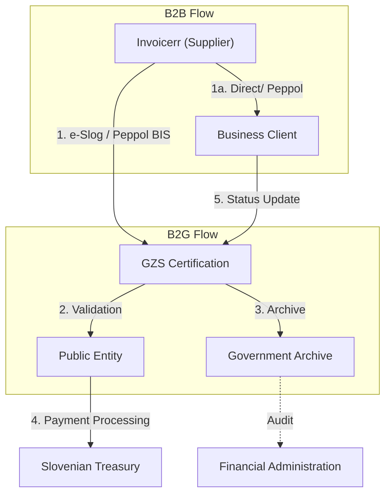

# 🇸🇮 Slovenia - E-Invoicing Specifications

**Status:** 🟢 **B2G Active** | 🔴 **B2B Voluntary** | 🟡 **ViDA 2030**
**Authority:** Financial Administration (Finančna uprava)
**Platform:** e-Slog / Peppol

---

## 1. Context & Overview

Slovenia has mandatory B2G e-invoicing through the e-Slog standard. B2B e-invoicing is voluntary but the country is preparing for ViDA 2030 requirements.

| Date | Scope | Obligation |
| --- | --- | --- |
| **2015** | B2G | Mandatory e-invoicing for public sector |
| **2018** | e-Slog 2.0 | Updated national standard released |
| **2024** | B2G Extended | Extended B2G requirements |
| **2030** | B2B ViDA | Mandatory e-invoicing under ViDA directive |

---

## 2. Technical Workflow

### 🧱 Key Components

1. **e-Slog:** Slovenian Electronic Invoice Standard (GZS certified)
2. **Peppol Network:** International interoperability
3. **GZS:** Chamber of Commerce (certification body)

---

## 3. Data Standards & Formats

### A. Accepted Formats

* **e-Slog** 2.0 (Slovenian national standard)
* **UBL 2.1** syntax
* **Peppol BIS Billing 3.0**
* **EN 16931** compliant XML

### B. Critical Data Fields

* **ID za DDV:** Slovenian VAT ID
* **Matična številka:** Company registration number
* **e-Slog Certificate:** Software certification

---

## 4. Business Model

* **B2G Post-Audit:** Invoice delivery via e-Slog/Peppol
* **B2B Post-Audit:** Voluntary, no clearance required
* **Software Certification:** e-Slog requires GZS certification

---

## 5. Implementation Checklist

* [ ] **e-Slog Certification:** Obtain GZS software certification
* [ ] **Peppol Access:** Set up Peppol participant identifier
* [ ] **B2G Registration:** Register for government e-invoicing
* [ ] **ViDA Preparation:** Plan for 2030 B2B mandate
* [ ] **Archive Setup:** Configure required storage

---

## 6. Resources

* **Financial Administration:** [Fu.gov.si](https://www.fu.gov.si)
* **e-Slog:** [Gzs.si](https://www.gzs.si)
* **Peppol Slovenia:** [Peppol.si](https://www.peppol.si)
