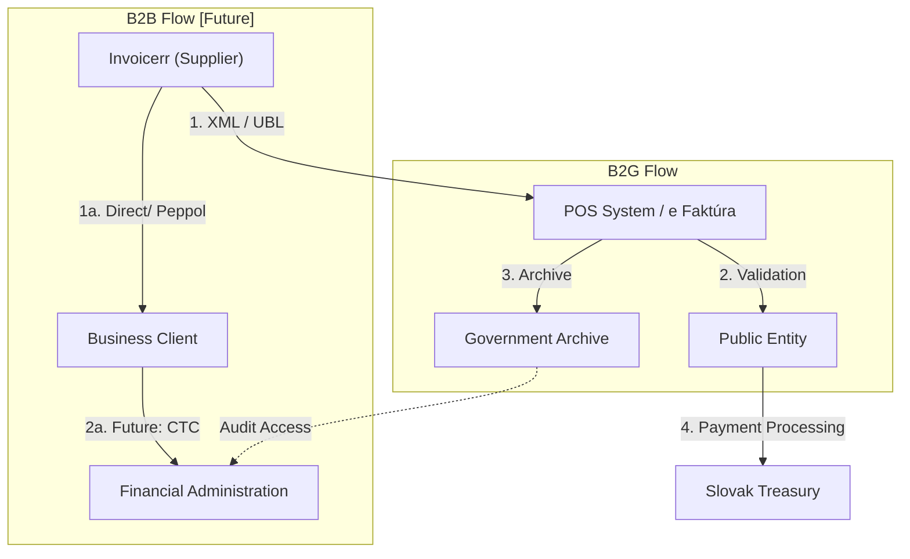

# 🇸🇰 Slovakia - E-Invoicing Specifications

**Status:** 🟢 **B2G Active** | 🟡 **B2B Planned** | 🟡 **ViDA 2030**
**Authority:** Financial Administration (Finančná správa)
**Platform:** POS (E-Invoice System) / e Faktúra

---

## 1. Context & Overview

Slovakia has mandatory B2G e-invoicing. B2B e-invoicing is currently voluntary with no clearance model, but the country is preparing for ViDA 2030 requirements.

| Date | Scope | Obligation |
| --- | --- | --- |
| **2018** | B2G | Mandatory e-invoicing for public sector |
| **Jan 2024** | B2G Extended | Extended B2G requirements |
| **2024** | B2B Monitoring | Business environment assessment |
| **2030** | B2B ViDA | Mandatory e-invoicing under ViDA directive |

---

## 2. Technical Workflow

### 🧱 Key Components

1. **POS (Pokladničný operačný systém):** E-Invoice System
2. **e Faktúra:** Web portal for invoice submission
3. **Peppol Network:** Cross-border interoperability

---

## 3. Data Standards & Formats

### A. Accepted Formats

* **XML format** (national schema)
* **UBL 2.1** syntax
* **EN 16931** compliance
* **Peppol BIS Billing 3.0**

### B. Critical Data Fields

* **IČO:** Slovak business registration number
* **IČ DPH:** Slovak VAT ID
* **Invoice Reference:** Unique identifier

---

## 4. Business Model

* **B2G Clearance:** Invoice validation through POS
* **B2B Post-Audit:** Voluntary, no current clearance model
* **Future ViDA:** Real-time reporting planned for 2030

---

## 5. Implementation Checklist

* [ ] **POS Registration:** Register for e-Invoice System access
* [ ] **XML Format:** Implement national XML schema
* [ ] **Peppol Access:** Set up cross-border connectivity
* [ ] **ViDA Preparation:** Plan for 2030 B2B mandate
* [ ] **Archive Configuration:** Set up required storage

---

## 6. Resources

* **Financial Administration:** [Financnasprava.sk](https://www.financnasprava.sk)
* **e Faktúra Portal:** [Einvoice.gov.sk](https://www.einvoice.gov.sk)
* **EU ViDA:** [ec.europa.eu/vida](https://ec.europa.eu)
