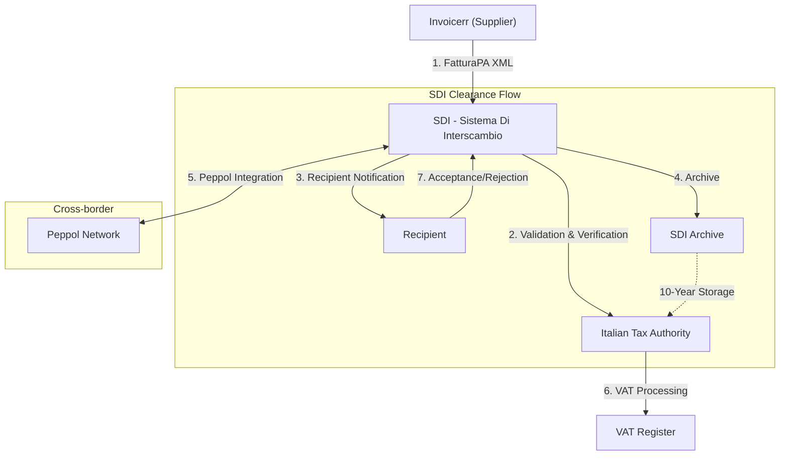

# 🇸🇲 San Marino - E-Invoicing Specifications

**Status:** 🟢 **Following Italy** | 🟢 **Mandatory** | 🟢 **SDI Integration**
**Authority:** Finance Authority / Italian SDI
**Platform:** SDI (Sistema Di Interscambio) / Peppol

---

## 1. Context & Overview

San Marino follows Italy's e-invoicing regulations due to economic and monetary union. Mandatory e-invoicing through the Italian SDI platform applies to all business transactions.

| Date | Scope | Obligation |
| --- | --- | --- |
| **2019** | All | Mandatory e-invoicing for all B2B/B2G |
| **Ongoing** | All | Continuous SDI reporting mandatory |
| **2024** | B2C | Extended to B2C transactions |
| **2030** | Cross-border | ViDA alignment for intra-EU B2B |

---

## 2. Technical Workflow

### 🧱 Key Components

1. **SDI (Sistema Di Interscambio):** Italian e-invoice exchange platform
2. **FatturaPA:** Italian national e-invoice format
3. **Peppol Integration:** Cross-border connectivity

---

## 3. Data Standards & Formats

### A. Accepted Formats

* **FatturaPA** format (Italian standard XML)
* **SDI Schema:** Strict validation rules
* **Peppol BIS:** For cross-border
* **EN 16931:** ViDA compliance

### B. Critical Data Fields

* **TIN:** San Marino tax ID
* **VAT Number:** San Marino VAT
* **SDI Code:** Codice destinatario (recipient code)
* **Fiscal Code:** Codice fiscale

---

## 4. Business Model

* **Clearance Model:** Real-time invoice validation through SDI
* **Italian Integration:** Full alignment with Italian system
* **Cross-border Ready:** Peppol connectivity available

---

## 5. Implementation Checklist

* [ ] **SDI Registration:** Register for SDI access
* [ ] **FatturaPA Support:** Implement Italian format
* [ ] **SDI Code:** Obtain recipient code
* [ ] **Digital Signature:** Qualified electronic signature
* [ ] **Lifecycle Management:** Acceptance/rejection workflows
* [ ] **Archive Setup:** Configure 10-year storage

---

## 6. Resources

* **Finance Authority:** [Segreteriafinanze.sm](https://www.segreteriafinanze.sm)
* **Italian SDI:** [Fatturapa.gov.it](https://www.fatturapa.gov.it)
* **Italian Revenue:** [Agenziaentrate.gov.it](https://www.agenziaentrate.gov.it)
