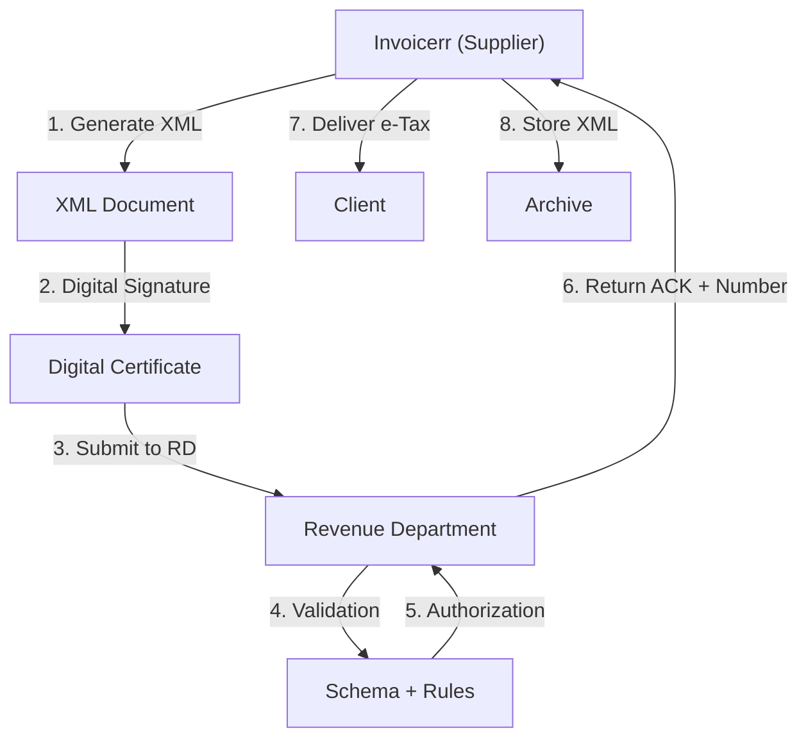

# 🇹🇭 Thailand - E-Invoicing Specifications (e-Tax Invoice)

**Status:** 🟢 **Mandatory** | Active for all VAT taxpayers
**Authority:** RD (Revenue Department)
**Platform:** e-Tax Invoice and Receipt System

---

## 1. Context & Overview

Thailand has mandatory e-invoicing through the Revenue Department's e-Tax system. All VAT-registered businesses must issue electronic tax invoices and receipts. The system requires digital signatures and real-time validation.

| Date | Scope | Obligation |
| --- | --- | --- |
| **2018+** | Large taxpayers | Progressive mandatory rollout |
| **2023+** | All VAT taxpayers | Full mandatory e-Tax |
| **Ongoing** | All businesses | Continuous RD compliance |

---

## 2. Technical Workflow (Clearance Model)

### 🧱 Key Components

1. **TIN (Tax Identification Number):** 13 digits
2. **Digital Certificate:** RD-approved
3. **e-Tax Format:** Revenue Department schema
4. **Serial Number:** Unique invoice numbering

---

## 3. Data Standards & Formats

### A. Required Format

- **XML Format:** RD e-Tax schema
- **Encoding:** TIS-620 / UTF-8
- **Digital Signature:** Required

### B. Document Types

| Type | Description |
| --- | --- |
| **ใบกำกับภาษี (Tax Invoice)** | Standard VAT invoice |
| **ใบเพิ่มหนี้ (Debit Note)** | Debit adjustment |
| **ใบลดหนี้ (Credit Note)** | Credit adjustment |
| **ใบเสร็จรับเงิน (Receipt)** | Payment receipt |

### C. Critical Data Fields

- **TIN:** Tax ID (13 digits)
- **VAT Rate:** 7% standard
- **Serial Number:** Unique identifier
- **Invoice Date:** Buddhist Era format

---

## 4. Business Model & Compliance

### A. Workflow

1. **TIN Registration:** Obtain Thai tax ID
2. **Certificate:** Acquire RD digital certificate
3. **XML Generation:** Create e-Tax document
4. **Signing:** Apply electronic signature
5. **Submission:** Send to Revenue Department
6. **Delivery:** Send to buyer

### B. Archiving

- **Retention:** 7 years
- **Format:** Original XML

---

## 5. Implementation Checklist

- [ ] **TIN Registration:** Obtain Thai tax ID
- [ ] **Digital Certificate:** Acquire RD certificate
- [ ] **XML Engine:** Build e-Tax schema generator
- [ ] **Signature Integration:** Implement signing
- [ ] **RD API:** Connect to e-Tax system
- [ ] **Document Types:** Support all types

---

## 6. Resources

- **Revenue Department:** [Rd.go.th](https://www.rd.go.th)
- **e-Tax Portal:** [Etax.rd.go.th](https://etax.rd.go.th)
