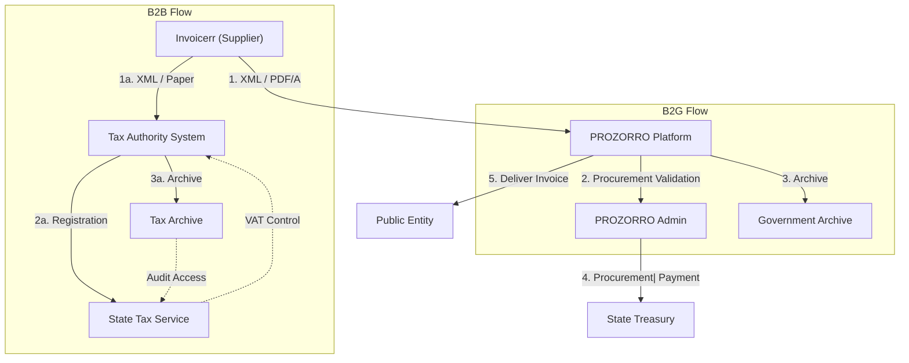

# 🇺🇦 Ukraine - E-Invoicing Specifications

**Status:** 🟢 **B2G Active** | 🟡 **B2B Progressive** | 🟢 **PROZORRO**
**Authority:** State Tax Service (DPS)
**Platform:** PROZORRO / Tax Authority Systems

---

## 1. Context & Overview

Ukraine has mandatory e-invoicing for B2G through PROZORRO and progressive requirements for B2B. The tax authority operates parallel systems for general business transactions.

| Date | Scope | Obligation |
| --- | --- | --- |
| **2016** | B2G PROZORRO | Mandatory for public procurement |
| **Ongoing** | B2G | PROZORRO platform mandatory |
| **2023** | B2B | Progressive e-invoicing requirements |
| **2024** | B2B Extended | Extended e-invoicing scope |
| **2030** | Cross-border | ViDA alignment preparation |

---

## 2. Technical Workflow

### 🧱 Key Components

1. **PROZORRO:** Public procurement e-invoicing platform
2. **Tax Authority System:** General B2B e-invoicing
3. **DPS:** State Tax Service (regulator)

---

## 3. Data Standards & Formats

### A. Accepted Formats

* **XML format** (national schema)
* **PDF/A** format (for certain transactions)
* **PROZORRO format:** Public procurement standard

### B. Critical Data Fields

* **TIN:** Ukrainian tax ID
* **EDRPOU:** Unified state register code
* **VAT Number:** VAT registration
* **PROZORRO ID:** Procurement identifier

---

## 4. Business Model

* **B2G Clearance:** PROZORRO mandatory for public procurement
* **B2B Progressive:** Progressive e-invoicing requirements
* **Dual System:** PROZORRO + Tax Authority parallel

---

## 5. Implementation Checklist

* [ ] **PROZORRO Registration:** Register for public procurement
* [ ] **Tax Authority Registration:** Register with DPS
* [ ] **XML Format:** Implement national XML schema
* [ ] **PDF/A Support:** Implement for certain transactions
* [ ] **Archive Setup:** Configure required storage

---

## 6. Resources

* **State Tax Service:** [Dps.gov.ua](https://www.dps.gov.ua)
* **PROZORRO:** [Prozorro.gov.ua](https://www.prozorro.gov.ua)
* **Ministry of Finance:** [Mof.gov.ua](https://www.mof.gov.ua)
