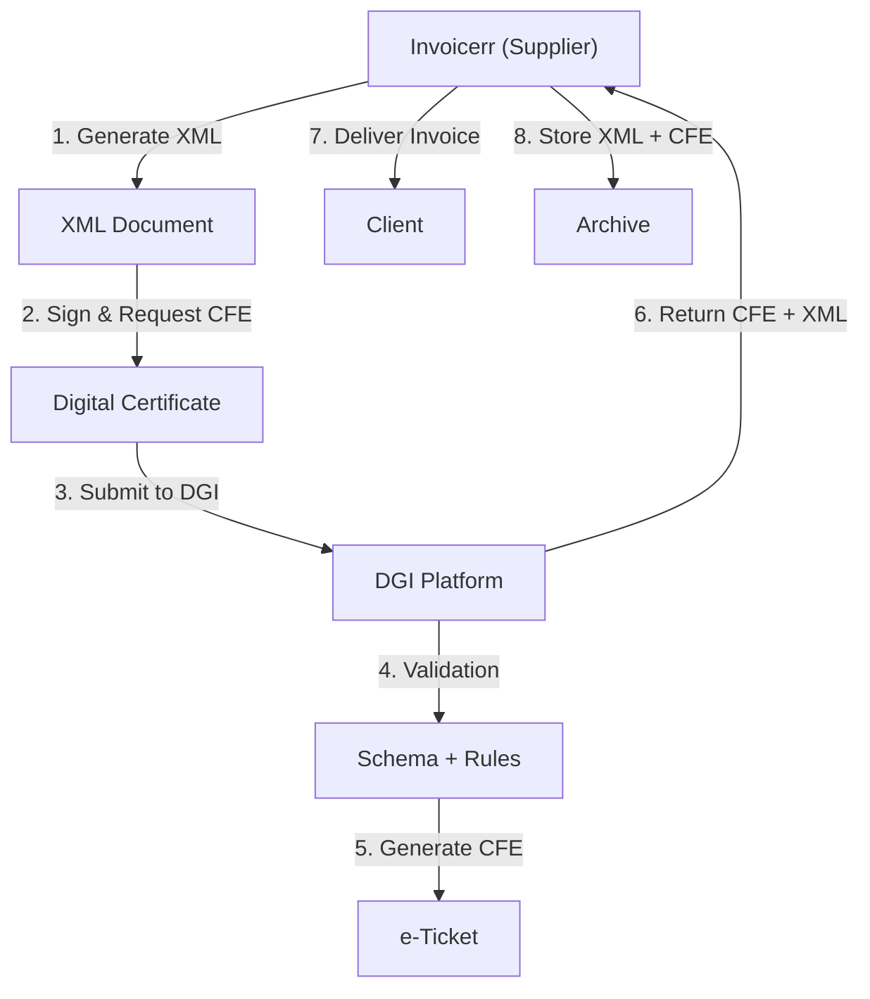

# 🇺🇾 Uruguay - E-Invoicing Specifications (DFE / CFE)

**Status:** 🟢 **Mandatory** | Active for all businesses
**Authority:** DGI (Dirección General de Impuestos)
**Platform:** DGI Electronic Invoice System (DFE)

---

## 1. Context & Overview

Uruguay has mandatory e-invoicing (documento fiscal electrónico - DFE) through DGI. The system follows a **Clearance Model** requiring e-ticket (CFE) authorization. Progressive implementation began in 2015.

| Date | Scope | Obligation |
| --- | --- | --- |
| **2015+** | Progressive | Initial rollout by category |
| **Ongoing** | All businesses | Continuous DGI authorization |
| **Current** | Full mandatory | All transaction types |

---

## 2. Technical Workflow (CFE Authorization)

### 🧱 Key Components

1. **CFE (Comprobante Fiscal Electrónico):** Electronic fiscal voucher (e-ticket)
2. **RUT (Registro Único Tributario):** Tax ID
3. **Digital Certificate:** DGI-approved
4. **e-Ticket:** Authorization document

---

## 3. Data Standards & Formats

### A. Required Format

- **XML Format:** DGI schema
- **Encoding:** UTF-8
- **Digital Signature:** Required

### B. Document Types

| Code | Type | Description |
| --- | --- | --- |
| **111** | e-Factura | Standard invoice |
| **112** | e-Factura Exportación | Export invoice |
| **113** | e-Nota Débito | Debit note |
| **114** | e-Nota Crédito | Credit note |
| **121** | e-Ticket | Consumer receipt |

### C. Critical Data Fields

- **RUT:** Tax ID (12 digits)
- **IVA:** VAT (22% standard)
- **CFE:** Authorization number
- **Tipo CFE:** Document type code

---

## 4. Business Model & Compliance

### A. Workflow

1. **RUT Registration:** Obtain Uruguayan tax ID
2. **Certificate:** Acquire DGI digital certificate
3. **XML Generation:** Create schema-compliant document
4. **Submission:** Send to DGI for CFE
5. **Delivery:** Send invoice + CFE to buyer

### B. Archiving

- **Retention:** 5 years
- **Format:** Original XML + CFE

---

## 5. Implementation Checklist

- [ ] **RUT Registration:** Obtain Uruguayan tax ID
- [ ] **Digital Certificate:** Acquire DGI certificate
- [ ] **XML Engine:** Build DGI schema generator
- [ ] **Signature Integration:** Implement signing
- [ ] **DGI API:** Connect to web services
- [ ] **CFE Processing:** Handle e-ticket responses

---

## 6. Resources

- **DGI Portal:** [Dgi.gub.uy](https://www.dgi.gub.uy)
- **E-Invoicing Section:** [CFE Uruguay](https://www.dgi.gub.uy/cfe)
