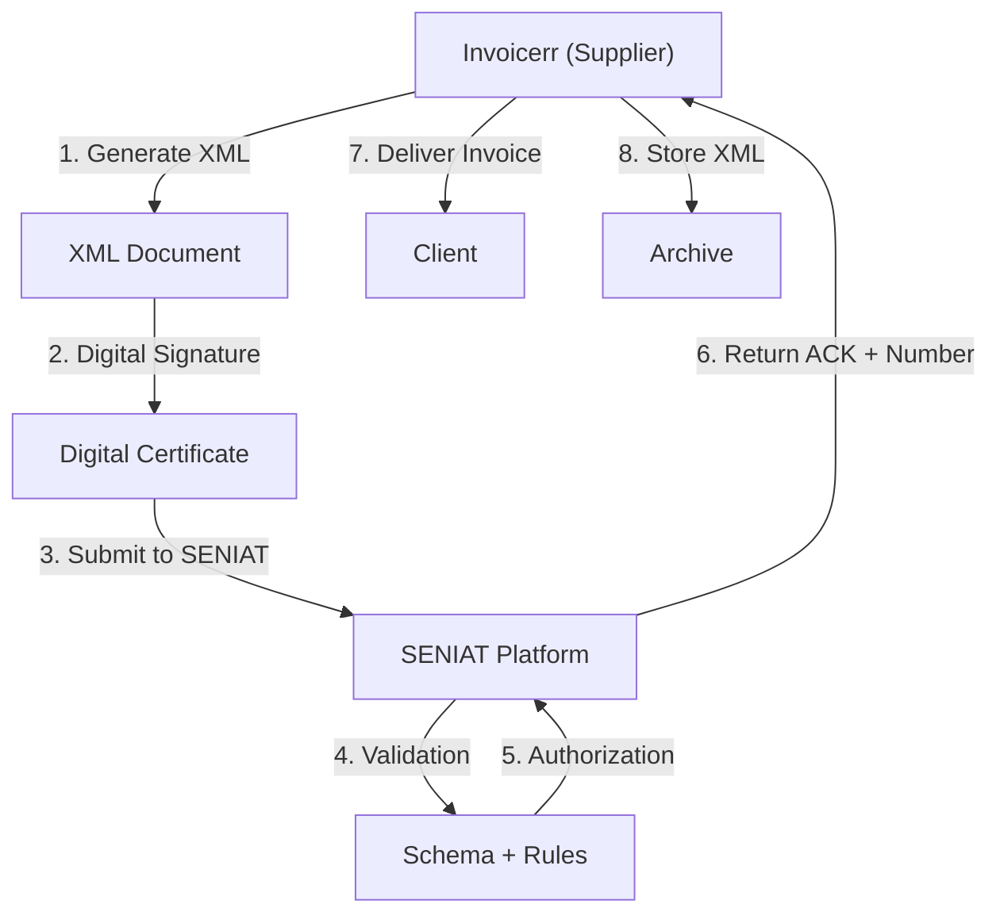

# 🇻🇪 Venezuela - E-Invoicing Specifications (Factura Electrónica)

**Status:** 🟢 **Mandatory** | Active for all businesses
**Authority:** SENIAT (Servicio Nacional Integrado de Administración Aduanera y Tributaria)
**Platform:** SENIAT Electronic Invoice System

---

## 1. Context & Overview

Venezuela has mandatory e-invoicing through SENIAT. The system follows a **Clearance Model** requiring pre-authorization. Progressive implementation began in 2015.

| Date | Scope | Obligation |
| --- | --- | --- |
| **2015+** | Progressive | Initial rollout by sector |
| **Ongoing** | All businesses | Continuous SENIAT authorization |
| **Current** | Full mandatory | All transaction types |

---

## 2. Technical Workflow (Clearance)

### 🧱 Key Components

1. **RIF (Registro de Información Fiscal):** Tax ID
2. **Digital Certificate:** SENIAT-approved

---

## 3. Data Standards & Formats

### A. Required Format

- **XML Format:** SENIAT national schema
- **Encoding:** UTF-8
- **Digital Signature:** Required

### B. Document Types

| Code | Type | Description |
| --- | --- | --- |
| **01** | Factura | Invoice |
| **02** | Nota Débito | Debit note |
| **03** | Nota Crédito | Credit note |
| **04** | Ajuste | Adjustment |

### C. Critical Data Fields

- **RIF:** Tax ID (10 digits)
- **IVA:** VAT (16% standard)
- **Número Control:** Control number

---

## 4. Business Model & Compliance

### A. Workflow

1. **RIF Registration:** Obtain Venezuelan tax ID
2. **Certificate:** Acquire SENIAT digital certificate
3. **XML Generation:** Create schema-compliant document
4. **Signing:** Apply electronic signature
5. **Submission:** Send to SENIAT
6. **Delivery:** Send to buyer

### B. Archiving

- **Retention:** 5 years
- **Format:** Original XML

---

## 5. Implementation Checklist

- [ ] **RIF Registration:** Obtain Venezuelan tax ID
- [ ] **Digital Certificate:** Acquire SENIAT certificate
- [ ] **XML Engine:** Build SENIAT schema generator
- [ ] **Signature Integration:** Implement signing
- [ ] **SENIAT API:** Connect to web services

---

## 6. Resources

- **SENIAT Portal:** [Seniat.gob.ve](https://www.seniat.gob.ve)
