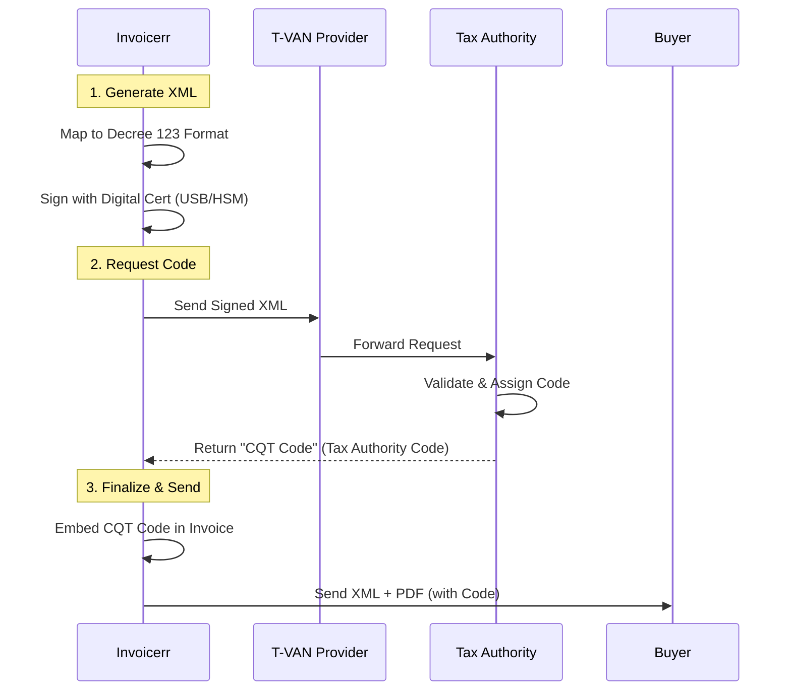

# 🇻🇳 Vietnam - Invoicing Specifications (GDT e-Invoice)

**Status:** 🔴 **Mandatory Clearance** (For nearly all businesses)
**Authority:** GDT (General Department of Taxation)
**System:** **Hoadondientu** (Electronic Invoice System)

---

## 1. Context & Roadmap

Vietnam mandates a Clearance system where invoices must be authenticated by the Tax Authority **before** being sent to the buyer (for most companies).
**Crucial Distinction:**

* **Invoice with Code:** Standard model. GDT generates a unique code for each invoice.
* **Invoice without Code:** Reserved for specific sectors (Utilities, Banking, Telco) with high volume and trusted ERPs.

| Date | Scope | Obligation |
| --- | --- | --- |
| **Active** | **All Businesses** | Mandatory e-invoicing (Decree 123/2020). |
| **Jan 1, 2026** | **New Decree 70** | Stricter rules for e-commerce and POS integration. |
| **Ongoing** | **VAT Reduction** | 8% VAT rate extended until Dec 2026. |

---

## 2. Technical Workflow (Authenticated Invoice)

Invoicerr must connect to a **T-VAN** provider (Value Added Network) to reach the GDT.

### 🧱 Key Components

1. **CQT Code (Mã của cơ quan thuế):** A unique string generated by the GDT. Without this, the invoice is invalid (for the "With Code" model).
2. **T-VAN:** Intermediary service providers licensed to transmit data to GDT.
3. **Digital Signature:** Mandatory. Usually a USB token or HSM-based signature (local standard).

---

## 3. Data Standards & Requirements

### A. Format: `XML` (Decree 123)

* **Syntax:** Specific XML schema defined by Circular 78/Decree 123.
* **Signature:** Must use a certificate issued by a Vietnamese CA.

### B. Critical Fields

* **Form Number (Mẫu số):** e.g., `1` (VAT Invoice), `2` (Sales Invoice).
* **Symbol (Ký hiệu):** e.g., `C26...` (C=Code, 26=Year).
* **Buyer Info:** Tax Code (MST) is mandatory for B2B.

---

## 4. Adjustments & Errors (Form 04/SS-HDDT)

Correction is strict. You cannot simply delete an invoice.

* **Form 04/SS-HDDT:** Must be submitted to GDT to report errors.
* **Adjustment Invoice:** Issued to correct value/quantity (linked to original).
* **Replacement Invoice:** Issued to replace a wrongly issued invoice (linked to original).

---

## 5. Implementation Checklist

* [ ] **T-VAN Connection:** Partner with a local T-VAN provider (e.g., BKAV, Viettel, VNPT). Direct GDT connection is hard.
* [ ] **Digital Signature:** Support integration with local USB tokens or cloud signing services.
* [ ] **Code Storage:** Store the returned **CQT Code** and render it clearly on the PDF representation.
* [ ] **Adjustment Logic:** Build flows for "Adjustment" and "Replacement" invoices referencing the original ID.

---

## 6. Resources

* **Official Portal:** [Hoadondientu.gdt.gov.vn](https://hoadondientu.gdt.gov.vn/)