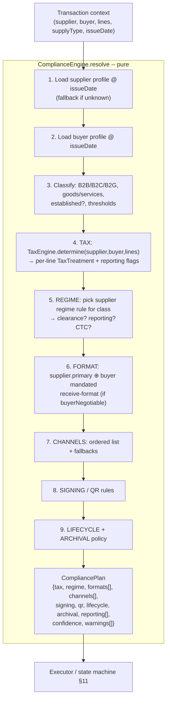
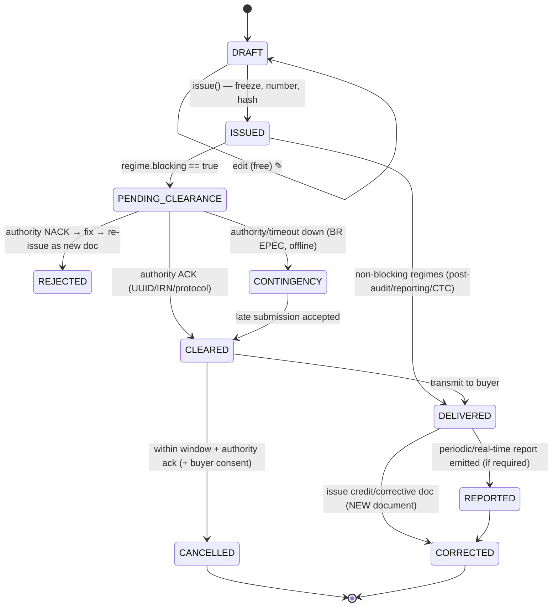
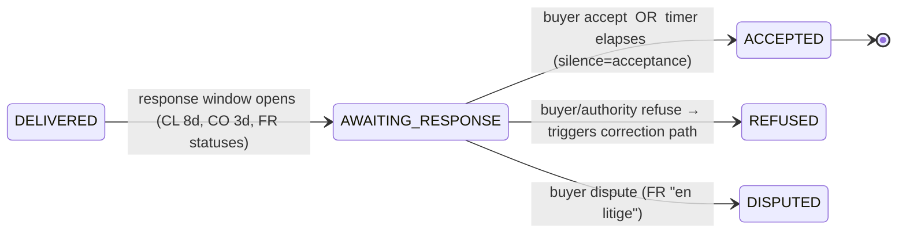
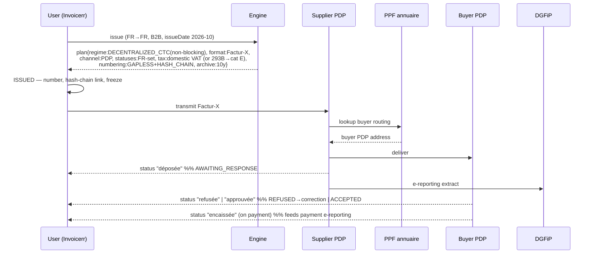
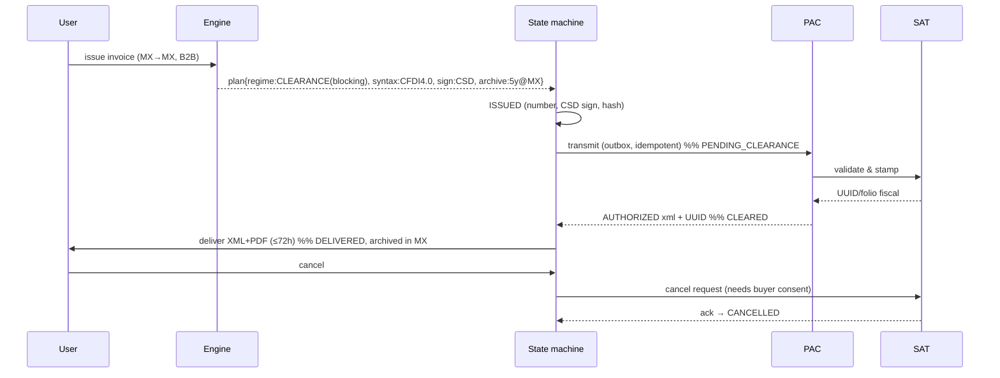

# Invoicerr — Global Compliance Architecture

> **Status:** Design / RFC — target branch `feat/compliance-architecture`
> **Scope:** A single architecture that makes every invoice issued by Invoicerr legally
> correct for the **issuer's country**, the **recipient's country**, and the **interaction
> between the two**, across the **whole document lifecycle** (issue, send, modify, correct,
> cancel, archive), for **every jurisdiction** documented under [`documentation/compliance/`](.)
> and the major economies (FR, IT, DE, ES, GB, US, …) that the long tail interacts with.
>
> This document is the canonical reference for *how* the system is built and a *proof of
> coverage*: it demonstrates, mechanically, that each country and each pathological
> cross-border case is expressible in the model.
>
> **v1.1 (design review).** A second pass over all 77 specs surfaced cases the first draft
> under-modelled. They are folded in here and called out explicitly in
> [§5 (axes K–P)](#5-the-compliance-taxonomy-orthogonal-dimensions),
> [§6](#6-canonical-domain-model), [§11.1 bidirectional lifecycle](#111-bidirectional-lifecycle-buyer-response--inbound),
> [§11.2 numbering/folio authorization](#112-numbering--folio-authorization), and the new worked
> cases in §16. **Honest verdict:** no static document can pre-enumerate *every* case, and this one
> does not claim to; what it claims — and §16 demonstrates — is that the model is **closed under
> "add a country" and "change a rule on a date"**, so new cases are absorbed as *data*, with the
> handful that need new *mechanisms* (buyer-response, folio ranges, multi-tax, withholding) now
> first-class. **France — the home market — was missing from `documentation/compliance/` entirely**; it is the
> reference flow in [§16.0](#160-france--the-home-market-reference-flow-the-hardest-eu-case).

---

## Table of contents

1. [Goals & non-goals](#1-goals--non-goals)
2. [Why this is hard (the real problem)](#2-why-this-is-hard-the-real-problem)
3. [Current state of the codebase](#3-current-state-of-the-codebase)
4. [Design principles](#4-design-principles)
5. [The compliance taxonomy (orthogonal dimensions)](#5-the-compliance-taxonomy-orthogonal-dimensions)
6. [Canonical domain model](#6-canonical-domain-model)
7. [The Country Compliance Profile (the heart)](#7-the-country-compliance-profile-the-heart)
8. [The Compliance Engine (resolution pipeline)](#8-the-compliance-engine-resolution-pipeline)
9. [The Tax Determination Engine (the cross-border brain)](#9-the-tax-determination-engine-the-cross-border-brain)
10. [Capability provider layers](#10-capability-provider-layers)
11. [The invoice lifecycle state machine](#11-the-invoice-lifecycle-state-machine)
12. [Reliability & robustness patterns](#12-reliability--robustness-patterns)
13. [Data model changes (Prisma)](#13-data-model-changes-prisma)
14. [Module & directory layout](#14-module--directory-layout)
15. [Proof of coverage I — every country maps to an archetype](#15-proof-of-coverage-i--every-country-maps-to-an-archetype)
16. [Proof of coverage II — the horrible cases, worked end to end](#16-proof-of-coverage-ii--the-horrible-cases-worked-end-to-end)
17. [Implementation roadmap](#17-implementation-roadmap)
18. [Risks & open questions](#18-risks--open-questions)

---

## 1. Goals & non-goals

### Goals

- **One engine, all jurisdictions.** No per-country `if` branches in business code. A country is
  *data* (a profile) plus, at most, a small *strategy plugin* for the one or two things that are
  genuinely unique (e.g. the CFDI XML shape).
- **Correct cross-border behaviour.** The tax treatment and obligations of `A → B` are *derived by
  composition* of profile(A) and profile(B), not enumerated. We never maintain an `N × N`
  country-pair matrix.
- **Whole lifecycle.** Issue, transmit, *amend before issuance*, *correct after issuance* (credit/
  debit/corrective documents), cancel, archive — each gated by the jurisdiction's rules.
- **Legally faithful artifacts.** The thing we store and the thing we transmit is the
  *legally authoritative* artifact (signed/cleared XML, hybrid PDF/A-3), not a best-effort render.
- **Temporal correctness.** Mandates phase in over years (FR 2026–2027, IE 2028–2030, ViDA 2030–2035).
  An invoice is judged by the rules **in force on its issue date**, not today's rules.
- **Fail safe, never fail silent.** An unknown country or an un-implemented obligation degrades to a
  conservative, explicitly-flagged fallback — never to silently-wrong output.

### Non-goals

- We do **not** hardcode legal accuracy into the architecture. Legal accuracy lives in *profile data*
  that is versioned and maintained as law changes. The architecture's job is to be *expressive enough*
  to encode any rule and to apply it deterministically.
- We do not (in v1) become a licensed PAC / Access Point ourselves. We *integrate* certified
  intermediaries (PDP, Peppol AP, PAC, OSE) behind a provider interface.
- We do not implement a full general-ledger / tax-return filing engine. We produce the data and
  side-effect records (EC Sales List lines, OSS lines, SAF-T entries) that feed those systems.

---

## 2. Why this is hard (the real problem)

A naïve reading is "generate the right XML per country." That is < 10% of the problem. The actual
difficulty is that **compliance is a function of a transaction, not of a country**, and a transaction
touches *two* jurisdictions with *independent* rule sets along *many orthogonal axes*:

```
                      ┌─────────────────────────────────────────────┐
   transaction  ───►  │  obligations = f( supplier-jurisdiction,     │
   (who, what,        │                    buyer-jurisdiction,       │  ───►  a Compliance Plan
    where, when)      │                    party-roles, supply-type, │
                      │                    issue-date )              │
                      └─────────────────────────────────────────────┘
```

Concretely, a single "send this invoice" action can require, **at the same time**:

- a **tax determination** that depends on both countries (FR→IT B2B = reverse charge; FR→US = export
  out-of-scope; US→FR = origin has no VAT at all, destination self-assesses);
- a **cleared XML** validated by the *supplier's* authority *before* the invoice is even valid
  (MX, BR, IT, SA, TR, many LATAM);
- a **structured e-invoice in a specific syntax** the *buyer* is mandated to receive (Peppol BIS,
  XRechnung, FatturaPA);
- a **human-readable hybrid PDF** for everyone else;
- a **digital signature** with a country-specific certificate type (CSD, ICP-Brasil, XAdES, …);
- a **QR code** with a country-specific payload (SA, IT B2C, PT, many LATAM);
- a **reporting side-effect** (EC Sales List / DEB, OSS, SAF-T, e-reporting);
- **immutability** of the issued document and a **correction path** that differs by country;
- **archival** for a country-specific number of years, sometimes with **data residency** in-country
  (MX 5y, SA 6y, BR 11y, all in-country).

And the rules **change on known future dates**. The architecture has to make all of this *composable*
and *data-driven*, or it collapses into an unmaintainable thicket of special cases.

---

## 3. Current state of the codebase

What exists today (the seed we build on):

| Area | Today | File(s) |
| --- | --- | --- |
| E-invoice generation | EN 16931 family only (Factur-X, ZUGFeRD, XRechnung, UBL, CII) via `@fin.cx/einvoice` | `invoices.service.ts:446` `getInvoiceXMLFormat`, `:577` `getInvoicePDFFormat` |
| Format selection | **One** company-wide field `invoicePDFFormat` | `schema.prisma:328` |
| Tax logic | Hardcoded: only French VAT exemption, string compare `country === 'FRANCE'` | `invoices.service.ts:113,201,396` |
| Country | **Free-text string** (`"FRANCE"`), hacked to a code via `country.slice(0,2)` | `invoices.service.ts:522,543` |
| Transmission | **Email only** (PDF attachment) | `invoices.service.ts:687` `sendInvoiceByEmail` |
| Lifecycle | CRUD: `create` / `edit` (free mutation) / soft `delete`; status ∈ {PAID, UNPAID, OVERDUE, SENT} | `invoices.service.ts:96,164,272` |
| Corrections | None. `Receipt` is a *payment* receipt, not a credit note | `schema.prisma:521` |
| Plugin system | DB-backed registry, types `SIGNING` + `STORAGE`, in-app providers | `plugins/index.ts`, `schema.prisma:573` |
| "Format plugin" hook | Stubbed: `canGenerateXml()` → `false`, `generateXml()` → throws | `plugins.service.ts:346,352` |
| Storage providers | Local + S3, used to upload *paid* invoice PDFs | `plugins/storage/`, `invoices.service.ts:671` |
| Events | Very granular webhook event enum | `schema.prisma:590` |

**Gap summary.** The codebase has a clean *plugin-registry pattern* and an EN-16931 generator — both
reusable. It has **no** concept of: clearance/CTC, transmission channels beyond email, immutability,
corrective documents, a tax engine, structured tax-residency data, legal archival with retention/
residency, audit chaining, or temporal rules. This architecture adds those as **new layers that reuse
the existing registry pattern** and **wrap (not rewrite)** the existing EN-16931 generator.

---

## 4. Design principles

1. **Profiles are data, behaviour is generic.** A jurisdiction is a declarative
   `CountryComplianceProfile` (§7). Business code reads profiles; it never names a country.
   Adding Kazakhstan = adding a profile (+ maybe one format strategy), not editing the engine.

2. **Composition over enumeration.** Cross-border behaviour is computed by *composing* two profiles
   through the Tax Engine and channel negotiation (§9). `N` profiles, not `N²` pairs. Adding the 78th
   country adds `1` profile and automatically yields its `77×2` new cross-border combinations.

3. **Supplier-jurisdiction is primary; buyer-jurisdiction modulates.** *You* must clear with *your*
   authority, sign with *your* certificate, archive under *your* law. The buyer's country contributes:
   place-of-supply tax rules, the buyer's mandated receiving format/channel, and your cross-border
   *reporting* obligations. This single rule resolves the "who governs what" question deterministically.

4. **Separate the four questions.** Every transaction answers them independently, then they are
   bundled into one plan:
   - **What tax?** → Tax Engine
   - **What document(s)?** → Format layer
   - **How is it made valid & sent?** → Clearance/Signing/Transmission layers
   - **What must persist & be reported?** → Archive + Reporting layers

5. **The legal artifact is first-class.** We persist the *authoritative* bytes (cleared/signed XML,
   hybrid PDF) with a content hash. Renders are derived; the artifact is the source of truth.

6. **Everything is temporal.** Every rule carries `validFrom`/`validTo`. Resolution always takes a
   `pointInTime` (the issue date). Back-dated invoices and future mandates "just work."

7. **Immutability by default after issuance.** Once `ISSUED`/`CLEARED`, an invoice is frozen; changes
   happen only through *new* corrective documents. Free editing exists **only** in `DRAFT`.

8. **Fail safe.** No profile ⇒ `FALLBACK` profile (plain PDF + EN-16931 attachment, post-audit, no
   clearance) **plus** a hard `complianceConfidence = UNVERIFIED` flag surfaced in the UI/API. We are
   never silently non-compliant.

9. **Idempotent, durable side-effects.** Clearance submission and transmission go through an
   **outbox** with idempotency keys; authorities are called at-least-once and de-duplicated.

---

## 5. The compliance taxonomy (orthogonal dimensions)

Every country's rules decompose into these independent axes. The profile schema (§7) has one field
group per axis. This taxonomy is the backbone of the whole design.

| # | Axis | Values (open enums) | Source examples |
| --- | --- | --- | --- |
| A | **Regime / CTC model** | `POST_AUDIT`, `PERIODIC_REPORTING`, `REAL_TIME_REPORTING`, `CLEARANCE`, `DECENTRALIZED_CTC` (Peppol 5-corner) | MX/BR/IT = clearance; FR(2026)/ViDA = decentralized CTC; ES SII = real-time reporting; ZA/GB = post-audit |
| B | **Document syntax** | `EN16931_UBL`, `EN16931_CII`, `FACTURX`/`ZUGFERD`, `XRECHNUNG`, `PEPPOL_BIS`, `FATTURAPA`, `CFDI`, `NFE`/`NFSE`, `KSA_UBL`, `TEIF`, `PLAIN_PDF`, … | EN family via `@fin.cx/einvoice`; national via strategies |
| C | **Party / tax identifiers** | `VAT`, `TIN`, `SIREN`/`SIRET`, `RFC`, `CNPJ`/`CPF`, `EIN`, `CRO`, `PEPPOL_ID`, `GLN`, … (required/optional, validation regex, checksum) | per profile |
| D | **Authority identifiers returned** | `UUID`/folio (MX), `chNFe`+protocol (BR), `SdI` id+receipt (IT), `IRN`+signed QR (IN), `ZATCA` hash/UUID (SA) | stored on the document |
| E | **Cryptography** | signature: `none`/`XAdES`/`CAdES`/`PAdES`; cert type: `CSD`/`ICP_BRASIL_A1A3`/`X509`/`QUALIFIED_SEAL`; QR spec | SA/IT/PT/LATAM |
| F | **Tax system** | `VAT`, `GST`, `SALES_TAX` (US), `CONSUMPTION_TAX`, `NONE`; rates; categories; place-of-supply rules; schemes (franchise/OSS/IOSS) | US = sales tax (no VAT!); GCC = VAT; FR = VAT + 293B |
| G | **Transmission channel** | `EMAIL`, `PEPPOL`, `GOV_PORTAL_API`, `PAC`, `PDP`, `OSE`, `PRINT` | per regime |
| H | **Lifecycle policy** | immutable-after: `ISSUE`/`CLEARANCE`; correction model: `CREDIT_NOTE`/`CORRECTIVE_INVOICE`/`CANCEL_REPLACE`; cancellation window; contingency mode | MX 3-day delivery; BR contingency; EU credit notes |
| I | **Archival** | retention years; data-residency country/region; archived format; integrity (`hash-chain`/`none`) | MX 5y-in-MX; BR 11y-in-BR; SA 6y-in-SA; EU 6–10y |
| J | **Transaction classification** | `B2B`/`B2C`/`B2G`; `GOODS`/`SERVICES`/`DIGITAL`/`MIXED`; established/non-established; simplified-vs-standard thresholds | drives F, G, H |
| K | **Numbering / folio authorization** *(v1.1)* | `GAPLESS_SELF` (issuer-sequenced) · `AUTHORITY_RANGE` (authority pre-allocates ranges you consume) · series scope: per-entity / per-branch-POS / per-doc-type / per-year-reset | CL CAF, AR CAE/CAEA, PE Serie-Número, MX folio; FR/PT gapless+chain |
| L | **Bidirectional lifecycle** *(v1.1)* | buyer/authority **response**: `ACCEPT`/`REJECT`/`DISPUTE`; mandatory **status messages**; `silence=acceptance` timers; **inbound reception** (must be able to *receive*) | CL 8-day + silence=accept; CO 3-day; PE CDR; FR mandatory statuses; IE/DK/FI must-receive |
| M | **Document-type taxonomy** *(v1.1)* | open, profile-mapped code lists → canonical roles: invoice · credit/debit note · cash receipt (boleta) · dispatch/waybill (guía) · export invoice · self-billed/purchase invoice · withholding/percepción receipt · payment receipt (complemento) · equivalent doc | CL 33/39/52/61, PE 01/03/40/41, CO 01-05, MX I/E/P/T |
| N | **Tax composition** *(v1.1)* | **multiple taxes per line** + **withholdings** (reduce amount *payable*, not base) | BR ICMS+IPI+PIS+COFINS+ISS; IN CGST+SGST+IGST; US state+county+city; PE Retención/Percepción; IT ritenuta |
| O | **Money & precision** *(v1.1)* | currency minor-units/decimals (JPY 0, KWD/BHD 3); rounding policy (line vs total vs per-tax); structured **allowances & charges** (line + document level) | EN16931 rounding amount; per-currency decimals |
| P | **Tax point & deadlines** *(v1.1)* | supply date ≠ issue date; **issuance deadline** (EU intra-EU: 15th of following month); delivery window; buyer download-access retention | MX/CL ≤72h delivery; PE 1-year download link |

> **Claim:** these axes are *complete* — every rule in all 77 `documentation/compliance/*` files, plus the
> majors, is an assignment of values to these axes (or a small strategy keyed by axis B/E). Axes A–J
> were in v1; K–P were added after a second review pass (see the per-axis source examples). §15 proves
> coverage by mapping every country; §16 proves the *interactions* compose correctly.

---

## 6. Canonical domain model

The internal, **format-agnostic** semantic invoice. Everything maps *to* this and *from* this; no
business logic ever speaks UBL or CFDI directly.

```ts
// The semantic invoice — superset of EN 16931 BIS, normalized.
interface CanonicalDocument {
  kind: DocumentKind;                // open, profile-mapped role (axis M): INVOICE · CREDIT_NOTE ·
                                     // DEBIT_NOTE · CORRECTIVE_INVOICE · PREPAYMENT/DEPOSIT ·
                                     // SELF_BILLED/PURCHASE · CASH_RECEIPT(boleta) · DISPATCH/WAYBILL ·
                                     // EXPORT_INVOICE · WITHHOLDING_RECEIPT · PAYMENT_RECEIPT(complemento) ·
                                     // EQUIVALENT_DOC.  national code (CL "52", PE "40"…) kept in extensions
  profileId: string;                 // resolved supplier profile id+version
  issueDate: Date;                   // drives all temporal resolution
  supplyDate?: Date;                  // tax point, may differ from issue
  number: DocumentNumber;            // sequential, gap-controlled, per series
  currency: CurrencyCode;
  taxCurrency?: CurrencyCode;        // when authority requires local currency (MX TipoCambio)
  exchangeRate?: { rate: number; date: Date; source: string };

  supplier: PartyTaxProfile;
  buyer: PartyTaxProfile;
  taxRepresentative?: PartyTaxProfile;   // fiscal rep for non-established suppliers

  lines: DocumentLine[];             // each with a *resolved* TaxTreatment
  totals: DocumentTotals;            // per-tax-category breakdown
  legalMentions: LegalMention[];     // localized, machine-tagged (reverse charge, 293B, …)
  references: DocumentReference[];   // corrected doc, order, contract, delivery
  attachments: Attachment[];

  // populated as the document moves through the lifecycle:
  authorityIdentifiers: AuthorityIdentifier[]; // UUID, IRN, SdI id, chNFe…
  qr?: QrPayload;
  signatures: SignatureRef[];
}

interface PartyTaxProfile {
  legalName: string;
  countryCode: ISO3166Alpha2;        // ISO codes everywhere — NOT free text
  establishmentCountry?: ISO3166Alpha2; // where actually established (≠ VAT-registered)
  role: 'B2B' | 'B2C' | 'B2G';
  identifiers: PartyIdentifier[];     // {scheme:'VAT', value, validated?}, {scheme:'SIRET',…}, peppolId…
  taxScheme?: 'STANDARD' | 'FRANCHISE_BASE' | 'FLAT_RATE' | 'EXEMPT' | 'MARGIN' | 'OSS' | 'IOSS';
  address: StructuredAddress;
}

// (v1.1) A line can carry SEVERAL taxes at once, plus withholdings — not one rate.
interface TaxComponent {                 // ONE tax on a line
  taxSystem: 'VAT' | 'GST' | 'SALES_TAX' | 'CONSUMPTION_TAX' | 'NONE';
  name: string;                          // VAT/IVA/ICMS/IPI/PIS/COFINS/ISS/CGST/SGST/IGST/state…
  category: TaxCategoryCode;             // EN16931 UNCL5305: S, Z, E, AE, K, G, O, L, M…
  rate: number;                          // 0 for reverse charge / export / exempt
  base?: MinorUnits;                     // taxable base if ≠ line net (compound / partial bases, BR)
  reason?: ExemptionReasonCode;          // VATEX-EU-AE, VATEX-EU-G, …
  jurisdiction: ISO3166Alpha2;
  subdivision?: string;                  // US state/county/city · BR UF · CA province
}

interface Withholding {                  // (v1.1) reduces amount *payable*, NOT the tax base
  name: string;                          // Retención IGV · Percepción · ritenuta d'acconto · IRPF
  rate: number; base: MinorUnits; amount: MinorUnits;
  generatesDocument?: DocumentKind;      // e.g. PE "Retención"/"Percepción" emit their own document
}

interface TaxTreatment {                 // the Tax Engine's per-line verdict
  components: TaxComponent[];            // ≥1 — the line's simultaneous taxes
  buyerSelfAssess?: boolean;             // reverse charge / import: buyer accounts for the tax
  reportingFlags: ReportingFlag[];       // EC_SALES_LIST, OSS, INTRASTAT, SAFT, SIRE, E_REPORTING…
}
```

**Money is never a float (v1.1).** All amounts are `MinorUnits` (integer in the currency's smallest
unit) carrying the currency's decimal count (JPY 0, EUR 2, KWD/BHD 3). `DocumentTotals` carries the
per-tax-category breakdown, document- and line-level **allowances & charges** (EN 16931 structured
discounts/surcharges), a **rounding amount**, document-level **withholdings**, and — when the profile
requires it — totals restated in the **tax currency** (axis O / §16.11). This replaces the current
`Float` columns (`schema.prisma` `totalHT/VAT/TTC`, `unitPrice`), which are a latent precision bug.

This canonical model is the **only** input to every format provider and the Tax Engine, and the
**only** thing persisted as structured data. It is intentionally a *superset* so that no national
field is lost (e.g. CFDI `UsoCFDI`, NF-e `NCM`, ZATCA invoice subtype, CL `TipoDTE`, national
document-type codes live in `line.extensions` / `document.extensions`, typed per profile).

---

## 7. The Country Compliance Profile (the heart)

A profile is a **versioned, temporal, declarative** description of one jurisdiction. It references
provider *ids* (not implementations) so the same profile works regardless of which concrete PAC /
Access Point an operator has configured.

```ts
interface CountryComplianceProfile {
  countryCode: ISO3166Alpha2;
  displayName: string;
  schemaVersion: string;
  /** When this profile *delegates* to another (Monaco→FR VAT territory, SM↔IT via SdI). */
  delegatesTo?: ISO3166Alpha2;

  /** Every rule list is temporal: the engine picks the entry whose [validFrom,validTo] covers
   *  the document's issueDate. This is how phased mandates are modelled. */
  regime:        Temporal<RegimeRule>[];
  formats:       Temporal<FormatRule>[];      // by classification (B2B/B2C/B2G, goods/services)
  identifiers:   IdentifierRequirement[];
  signing:       Temporal<SigningRule | null>[];
  qr:            Temporal<QrRule | null>[];
  transmission:  Temporal<TransmissionRule>[]; // ordered, with fallbacks
  taxSystem:     TaxSystemSpec;                // §9
  lifecycle:     Temporal<LifecyclePolicy>[];
  archival:      Temporal<ArchivalPolicy>[];
  reporting:     Temporal<ReportingObligation>[]; // EC sales list, OSS, SAF-T, e-reporting

  /** Hooks for the genuinely-unique 10%: a strategy plugin id the engine resolves at runtime. */
  strategies?: {
    numbering?: string;        // e.g. PT ATCUD, BR access-key composition
    formatBuilder?: string;    // e.g. 'cfdi-4.0', 'fatturapa-1.2', 'nfe-4.0'
    taxOverride?: string;      // exotic local rules the generic engine can't express
  };

  confidence: 'OFFICIAL' | 'BEST_EFFORT' | 'PLANNED' | 'FALLBACK';
}

interface Temporal<T> { validFrom: Date; validTo?: Date; value: T; }

interface RegimeRule {
  model: 'POST_AUDIT' | 'PERIODIC_REPORTING' | 'REAL_TIME_REPORTING'
       | 'CLEARANCE' | 'DECENTRALIZED_CTC';
  appliesTo: ClassificationSelector;          // {roles:['B2B'], supply:['GOODS','SERVICES']}
  blocking: boolean;                          // clearance: invoice invalid until authorized?
}

interface FormatRule {
  appliesTo: ClassificationSelector;
  primary: FormatSpec;                        // the legally-required artifact
  human?: FormatSpec;                         // hybrid PDF for readability
  buyerNegotiable: boolean;                   // may be overridden by buyer's mandated receive-format
}

interface LifecyclePolicy {
  immutableAfter: 'ISSUE' | 'CLEARANCE' | 'NEVER';
  correctionModel: 'CREDIT_NOTE' | 'CORRECTIVE_INVOICE' | 'CANCEL_AND_REPLACE';
  cancellation: { allowed: boolean; windowHours?: number; requiresAuthorityAck: boolean;
                  requiresBuyerConsent?: boolean };
  contingency?: { mode: string; offlineIssue: boolean; submitWithinHours: number }; // BR EPEC/SCAN
}

interface ArchivalPolicy {
  retentionYears: number;
  residency?: ISO3166Alpha2 | Region;         // null = anywhere; 'MX' = must store in Mexico
  archivedForm: 'AUTHORITATIVE_XML' | 'HYBRID_PDF' | 'BOTH';
  integrity: 'NONE' | 'HASH_CHAIN' | 'SIGNED';
}
```

A profile is just a TypeScript/JSON object. Example skeletons (abbreviated) for three archetypes:

```ts
// FRANCE — decentralized CTC from 2026/2027, VAT with franchise-base, hash-chain audit.
const FR: CountryComplianceProfile = {
  countryCode: 'FR', displayName: 'France', schemaVersion: '1.0', confidence: 'OFFICIAL',
  regime: [
    { validFrom: '1900-01-01', validTo: '2026-08-31', value: { model:'POST_AUDIT', appliesTo:ALL, blocking:false } },
    { validFrom: '2026-09-01', value: { model:'DECENTRALIZED_CTC', appliesTo:{roles:['B2B','B2G']}, blocking:false } },
  ],
  formats: [{ validFrom:'2026-09-01', value:{ appliesTo:{roles:['B2B','B2G']},
              primary:{syntax:'FACTURX'}, human:{syntax:'PDF_A3'}, buyerNegotiable:true } }],
  transmission: [{ validFrom:'2026-09-01', value:{ channels:[{type:'PDP'},{type:'PEPPOL'},{type:'EMAIL'}] } }],
  taxSystem: { kind:'VAT', schemes:['STANDARD','FRANCHISE_BASE'], /* 293B → cat E + mention */ },
  lifecycle: [{ validFrom:'1900-01-01', value:{ immutableAfter:'ISSUE', correctionModel:'CREDIT_NOTE',
              cancellation:{allowed:true, requiresAuthorityAck:false} } }],
  archival: [{ validFrom:'1900-01-01', value:{ retentionYears:10, archivedForm:'BOTH', integrity:'HASH_CHAIN' } }],
  reporting: [{ validFrom:'2026-09-01', value:{ kinds:['E_REPORTING'] } }], // B2C + cross-border e-reporting
};

// MEXICO — clearance via PAC, national CFDI, in-country 5y archive.
const MX: CountryComplianceProfile = {
  countryCode:'MX', displayName:'Mexico', schemaVersion:'1.0', confidence:'OFFICIAL',
  regime:[{ validFrom:'2014-01-01', value:{ model:'CLEARANCE', appliesTo:ALL, blocking:true } }],
  formats:[{ validFrom:'2023-04-01', value:{ appliesTo:ALL, primary:{syntax:'CFDI', version:'4.0'},
             human:{syntax:'PDF'}, buyerNegotiable:false } }],
  signing:[{ validFrom:'2014-01-01', value:{ algo:'XAdES', cert:'CSD' } }],
  transmission:[{ validFrom:'2014-01-01', value:{ channels:[{type:'PAC'}], deliverToBuyerWithinHours:72 } }],
  taxSystem:{ kind:'VAT', /* IVA 16/8/0, IEPS via extension */ requiresTaxCurrency:'MXN' },
  lifecycle:[{ validFrom:'2022-01-01', value:{ immutableAfter:'CLEARANCE', correctionModel:'CREDIT_NOTE',
             cancellation:{allowed:true, requiresAuthorityAck:true, requiresBuyerConsent:true} } }],
  archival:[{ validFrom:'2014-01-01', value:{ retentionYears:5, residency:'MX', archivedForm:'AUTHORITATIVE_XML', integrity:'SIGNED' } }],
  strategies:{ formatBuilder:'cfdi-4.0', numbering:'cfdi-folio' },
};

// UNITED STATES — no VAT, sales/use tax by state, no federal e-invoicing mandate.
const US: CountryComplianceProfile = {
  countryCode:'US', displayName:'United States', schemaVersion:'1.0', confidence:'OFFICIAL',
  regime:[{ validFrom:'1900-01-01', value:{ model:'POST_AUDIT', appliesTo:ALL, blocking:false } }],
  formats:[{ validFrom:'1900-01-01', value:{ appliesTo:ALL, primary:{syntax:'PDF'},
             // optional structured exchange via DBNAlliance (Peppol-like) when both parties opt in:
             buyerNegotiable:true } }],
  taxSystem:{ kind:'SALES_TAX', /* destination-based, nexus + economic-nexus thresholds per state */ },
  lifecycle:[{ validFrom:'1900-01-01', value:{ immutableAfter:'NEVER', correctionModel:'CREDIT_NOTE',
             cancellation:{allowed:true, requiresAuthorityAck:false} } }],
  archival:[{ validFrom:'1900-01-01', value:{ retentionYears:7, archivedForm:'HYBRID_PDF', integrity:'NONE' } }],
};
```

> **The point:** FR, MX and US — three radically different worlds — are the *same shape*. The engine
> reads the shape; it never branches on the country name.

---

## 8. The Compliance Engine (resolution pipeline)

The engine turns a transaction into a **Compliance Plan**: an explicit, inspectable bundle of
everything that must happen. It is **pure** (no I/O) and therefore fully unit-testable — given a
transaction + the profile registry + a clock, it returns a plan. Execution (I/O) is a separate step.



```ts
interface CompliancePlan {
  supplierProfile: ProfileRef;  buyerProfile: ProfileRef;
  classification: TransactionClassification;
  tax: TaxResult;                       // per line + totals + legal mentions
  regime: RegimeRule;                   // governs whether clearance is blocking
  artifacts: PlannedArtifact[];         // [{role:'AUTHORITATIVE', syntax:'CFDI'}, {role:'HUMAN', syntax:'PDF'}, {role:'BUYER', syntax:'PEPPOL_BIS'}]
  channels: PlannedChannel[];           // ordered, each with fallback
  signing?: SigningRule;  qr?: QrRule;
  lifecycle: LifecyclePolicy;
  archival: ArchivalPolicy;
  reporting: ReportingObligation[];
  confidence: Confidence;               // min() over the inputs used
  warnings: ComplianceWarning[];        // surfaced to UI/API, never swallowed
}
```

**Resolution rules that make composition work (step-by-step):**

- **Step 1–2 (profiles).** Supplier and buyer profiles are loaded *as of the issue date*. A
  `delegatesTo` profile (Monaco→FR, San Marino↔IT) is transparently followed.
- **Step 4 (tax) is the only step that reads *both* profiles deeply.** Everything else is
  supplier-driven, with the buyer contributing at most the *receive-format* (step 6). This is the
  formalization of principle #3 and is *why* we never need an `N²` matrix.
- **Step 6 (format negotiation).** `primary` is what the supplier's law requires. If the supplier's
  law marks it `buyerNegotiable` and the buyer's profile mandates a specific *receive* format
  (e.g. an Italian PA buyer ⇒ FatturaPA via SdI; a German public body ⇒ XRechnung), the engine adds a
  `BUYER`-role artifact in the buyer's syntax. The supplier's `AUTHORITATIVE` artifact is never dropped.
- **Step 7 (channels).** Channels are an *ordered list with fallbacks*: e.g. `[PEPPOL → EMAIL]` so a
  missing buyer Peppol ID degrades to email; `[PAC]` with no fallback for blocking clearance (you
  cannot "fall back" out of a legal clearance — instead you enter contingency, §11/§12).
- **Confidence** is the `min` over every profile/rule consulted. A `FR→XX` invoice where `XX` is a
  `PLANNED` profile yields `confidence = PLANNED` and a visible warning, even though FR is `OFFICIAL`.

---

## 9. The Tax Determination Engine (the cross-border brain)

This is where `FR→IT`, `US→FR`, `FR→US` are actually decided. It is a **deterministic rule cascade**
over `(supplierTaxSystem, buyerTaxSystem, sameCountry?, sameTaxUnion?, role, supplyType, validations)`,
producing per-line `TaxTreatment` and document-level `LegalMention`s and `ReportingFlag`s.

```ts
function determineLineTax(s: PartyTaxProfile, b: PartyTaxProfile, line: Line,
                          sp: Profile, bp: Profile, at: Date): TaxTreatment {

  const sys = sp.taxSystem.kind;                       // VAT | GST | SALES_TAX | NONE
  const sameCountry = s.countryCode === b.countryCode;
  const union = taxUnionOf(s, at);                     // 'EU' | 'GCC' | null
  const inSameUnion = union && union === taxUnionOf(b, at);

  // --- 0. Supplier has no VAT system at all (e.g. US) -------------------------
  if (sys === 'SALES_TAX') return salesTax(s, b, line, sp);   // US: state nexus, destination rate
  if (sys === 'NONE')      return { taxSystem:'NONE', category:'O', rate:0, jurisdiction:s.countryCode };

  // --- VAT / GST world -------------------------------------------------------
  // 1. Domestic
  if (sameCountry) return domesticVat(line, sp, s.taxScheme); // standard/reduced/exempt; FR 293B → E

  // 2. Cross-border, both in the SAME tax union (EU↔EU, GCC↔GCC)
  if (inSameUnion) {
    if (b.role === 'B2B' && vatValidated(b)) {               // VIES-valid buyer VAT
      return line.supplyType === 'GOODS'
        ? { taxSystem:sys, category:'K', rate:0,             // intra-Community supply of goods
            reason:'VATEX-EU-IC', jurisdiction:s.countryCode,
            reportingFlags:['EC_SALES_LIST','INTRASTAT'] }
        : { taxSystem:sys, category:'AE', rate:0,            // B2B services → reverse charge
            reason:'VATEX-EU-AE', jurisdiction:b.countryCode,
            reportingFlags:['EC_SALES_LIST'] };
    }
    // B2C across the union
    if (line.supplyType === 'GOODS' || line.supplyType === 'DIGITAL') {
      return ossDestinationVat(b, line, at);                 // OSS / distance-selling threshold
    }
    return domesticVat(line, sp, s.taxScheme);               // default: tax where supplier is
  }

  // 3. Supplier in a VAT union, buyer OUTSIDE it
  if (line.supplyType === 'GOODS')
    return { taxSystem:sys, category:'G', rate:0,            // export of goods, zero-rated
             reason:'VATEX-EU-G', jurisdiction:s.countryCode, reportingFlags:['CUSTOMS_EXPORT'] };
  // services to non-union: place of supply usually the customer ⇒ out of scope for supplier
  return { taxSystem:sys, category:'O', rate:0,              // outside scope; buyer self-assesses
           reason:'VATEX-EU-O', jurisdiction:b.countryCode };
}
```

**Worked verdicts (the cases the user named):**

| Transaction | Supplier sys | Path | Category & rate | Legal mention | Reporting |
| --- | --- | --- | --- | --- | --- |
| **FR → IT**, B2B services | VAT, both EU | §2 reverse charge | `AE`, 0% | "Autoliquidation / Reverse charge — Art. 196 Directive 2006/112/EC" | EC Sales List (FR) |
| **FR → IT**, B2B goods | VAT, both EU | §2 intra-Comm. | `K`, 0% | "Intra-Community supply — Art. 138" | EC Sales List + Intrastat/DEB |
| **US → FR**, B2B services | **SALES_TAX** | §0 | `O`/none, 0% | none on US side; **FR buyer self-assesses import VAT** | none (US) |
| **FR → US**, B2B services | VAT, US outside EU | §3 services | `O`, 0% | "VAT not applicable — services supplied outside the EU" | — |
| **FR → US**, goods | VAT, export | §3 goods | `G`, 0% | "Export — zero-rated, Art. 146" | customs/export |
| **FR → FR**, B2C | VAT domestic | §1 | `S`, 20% | — | — |
| **FR (293B) → FR** | VAT, franchise | §1 scheme | `E`, 0% | "TVA non applicable, art. 293 B du CGI" | — |
| **SA → SA**, B2B | VAT (GCC) | §1 | `S`, 15% | — | ZATCA clearance |
| **DE → FR**, B2C goods over €10k | VAT, EU | §2 B2C goods | dest. rate (FR 20%) via **OSS** | — | OSS return (DE) |

> This single function replaces the current hardcoded `country === 'FRANCE'` exemption
> (`invoices.service.ts:113`) and generalizes it to every pair. `salesTax()`, `domesticVat()`,
> `ossDestinationVat()` are small, profile-driven sub-resolvers; `vatValidated()` calls VIES (EU) /
> the relevant registry, cached, with a "treated as B2C if unvalidated" safe default.

---

## 10. Capability provider layers

We extend the **existing** plugin-registry pattern (`plugins/index.ts`, today `SIGNING`+`STORAGE`)
with new provider *types*. Each type is a narrow interface; concrete providers are swappable and
operator-configured exactly like the current Documenso / S3 providers.

```ts
// B — Format. Wraps @fin.cx/einvoice for the EN family; national strategies implement the rest.
interface FormatProvider {
  id: string;                                  // 'en16931', 'cfdi-4.0', 'fatturapa-1.2', 'nfe-4.0'
  supports(spec: FormatSpec): boolean;
  build(doc: CanonicalDocument, plan: CompliancePlan): Promise<RenderedArtifact>; // bytes + mime + role
  validate(artifact: RenderedArtifact): Promise<ValidationReport>;  // XSD + Schematron/EN16931 rules
}

// E — Signing (extends today's SIGNING type). XAdES/CAdES/PAdES + cert backends + QR.
interface SigningProvider {
  id: string; algorithms: SignAlgo[];
  sign(artifact: RenderedArtifact, cert: CertRef): Promise<SignedArtifact>;
  buildQr?(doc: CanonicalDocument, rule: QrRule): Promise<QrPayload>;
}

// G — Transmission (NEW type, modelled on STORAGE's multi-instance registry).
interface TransmissionProvider {
  id: string; channelType: ChannelType;        // EMAIL | PEPPOL | GOV_PORTAL_API | PAC | PDP | OSE
  transmit(artifact: SignedArtifact, plan: CompliancePlan,
           idempotencyKey: string): Promise<TransmissionResult>;
  // for clearance providers: returns authority ids + the AUTHORIZED artifact, and may be async
  poll?(ref: TransmissionRef): Promise<TransmissionResult>;
}

// I — Legal archive (extends today's STORAGE). Adds retention + residency routing + WORM.
interface ArchiveProvider {
  id: string; regions: Region[];
  store(artifact: SignedArtifact, policy: ArchivalPolicy): Promise<ArchiveReceipt>; // immutable, retained
}
```

Resolution of *which* provider executes a plan step:

- **Format**: `plan.artifacts[].syntax` → first `FormatProvider.supports()` (national strategy wins
  over generic EN). The current `getInvoiceXMLFormat()` becomes the `en16931` provider's `build()`,
  essentially unchanged — we *wrap*, not rewrite.
- **Transmission**: `plan.channels[]` matched to active providers by `channelType`; clearance channels
  are mandatory and route through the configured PAC/PDP/Access Point for the supplier country.
- **Archive**: `plan.archival.residency` selects a provider whose `regions` include it (MX→an MX/LATAM
  bucket; SA→a KSA bucket), falling back to the operator default when residency is unconstrained.

This means the **stubbed** `plugins.service.ts` `canGenerateXml/generateXml` (lines 346–357) become
the real `FormatProvider` dispatch, and the `PDF_FORMAT`/`PAYMENT`/`OIDC` enum hints already present in
`getPluginTypeEnum` (lines 330–344) are realized as first-class provider types.

---

## 11. The invoice lifecycle state machine

The biggest behavioural change. Invoices gain a **compliance status** orthogonal to the existing
**payment status** (`PAID/UNPAID/OVERDUE/SENT` stays as-is for the AR view). Compliance status is a
strict state machine; transitions are the *only* way to mutate an issued invoice.



Rules enforced at the boundary:

- **`DRAFT` is the only free-edit state.** The current `editInvoice` (`invoices.service.ts:164`) is
  restricted to `DRAFT`; calling it on an issued invoice throws and the API steers the caller to the
  correction flow.
- **`issue()` freezes.** It assigns the gap-controlled sequential number, snapshots the
  `CanonicalDocument`, computes `immutableHash`, links the previous document's hash
  (`HASH_CHAIN` jurisdictions: FR, PT), and writes the first `ComplianceEvent`.
- **Correction is a new document, not a mutation.** `correctionModel` decides the shape:
  `CREDIT_NOTE` (EU: issue an avoir + optionally a fresh invoice), `CORRECTIVE_INVOICE`
  (some LATAM), `CANCEL_AND_REPLACE` (clearance systems with substitution). The new document
  `references` the old one; the old one stays immutable.
- **Cancellation is policy-gated.** `cancellation.windowHours`, `requiresAuthorityAck`,
  `requiresBuyerConsent` (MX!) are enforced before the `CANCELLED` transition; the authority call goes
  through the transmission outbox.
- **Contingency** is a real state (BR EPEC/SCAN, generic "authority down"): the invoice is *issued and
  delivered offline* with a contingency marker, and a background job submits it once the authority is
  back, transitioning to `CLEARED` (§12).

### 11.1 Bidirectional lifecycle: buyer response & inbound *(v1.1)*

The v1 state machine was **outbound-only** — a real gap. Many regimes are *bidirectional*: after
delivery the **buyer (or authority) sends back a response** that changes the document's legal state,
often on a **deadline with `silence = acceptance`**, and most mandates also require the issuer to be
able to **receive** inbound e-invoices. This is modelled as a parallel response track:



- **Response model per profile** (`lifecycle.response`): `{ window, defaultOnSilence:'ACCEPT'|'NONE',
  statuses:[…] }`. CL/CO = silence-accept timers; **France mandates a status set** (deposited,
  rejected, refused, **cashed/encaissée**, plus recommended approved/disputed) — see §16.0.
- **Status messages are first-class artifacts**, transmitted on the same channel (Peppol Invoice
  Response/MLR, IT SdI receipts, PE CDR, FR PDP statuses) and stored as `ComplianceEvent`s. The
  Peruvian **CDR** and Chilean **acuse** are just inbound status messages in this model.
- **Inbound reception is a peer of issuance.** A `ReceptionService` accepts e-invoices addressed to
  *us* (Peppol AP, SdI, PDP, email), validates, persists a received `CanonicalDocument`, and emits the
  required buyer-side status. IE/DK/FI/DE/FR all mandate *receive* capability before *send*; this is
  required for completeness, not optional.

### 11.2 Numbering & folio authorization *(v1.1)*

Numbering is not always "increment a counter." Two models, selected per profile (axis K):

- **`GAPLESS_SELF`** — issuer assigns a strictly sequential, gap-controlled number inside the `issue()`
  transaction (current `invoiceNumberFormat` masks stay). Required by FR/PT and most post-audit/EU
  regimes; FR/PT additionally **hash-chain** consecutive documents for inalterability.
- **`AUTHORITY_RANGE`** — the authority **pre-allocates** number/folio ranges the issuer *consumes*
  (CL **CAF**, AR **CAE/CAEA**, MX folio, PE **Serie-Número**). A `FolioPool` sub-system requests
  ranges ahead of depletion, tracks consumption atomically, blocks issuance when exhausted, and
  handles range expiry/renewal. Series are scoped per **entity / branch-POS / document-type / year**
  as the profile dictates (a credit note, a boleta and a waybill draw from *different* series).

Both feed the same `issue()` transition; the difference is whether the next number comes from a local
counter or a reserved pool. The outbox guarantees no number is burned on a crash (§12).

---

## 12. Reliability & robustness patterns

The features that make this *production-grade*, not a demo:

1. **Transactional outbox for all authority/buyer I/O.** `issue()` and `transmit()` write the intent
   to an `OutboxMessage` row *in the same DB transaction* as the state change. A dispatcher delivers
   it at-least-once. Authorities are slow, flaky, and rate-limited; we never lose a submission and
   never double-submit (idempotency key = `documentId + step + attempt-of-record`).

2. **Async clearance with a state machine, not a blocking HTTP call.** Clearance can take seconds to
   minutes (and can be down). The API returns immediately with `PENDING_CLEARANCE`; SSE/webhooks push
   the `CLEARED`/`REJECTED` result. The existing SSE endpoint (`invoices.controller.ts:34`) and
   webhook events (`schema.prisma:590`) are reused; we add `INVOICE_CLEARED`, `INVOICE_REJECTED`,
   `INVOICE_REPORTED`, `INVOICE_CANCELLED`, `CREDIT_NOTE_ISSUED`.

3. **Contingency / graceful degradation.** Blocking-clearance country with the authority unreachable ⇒
   enter `CONTINGENCY`, emit the legally-allowed offline artifact (e.g. BR EPEC), queue the real
   submission. Non-blocking ⇒ deliver now, report later. We *degrade*, never *drop*.

4. **Validation gate before transmit.** Every artifact passes its `FormatProvider.validate()`
   (XSD + EN-16931 Schematron / national business rules) *before* it touches an authority. A
   validation failure stops at `ISSUED` with actionable errors — we never submit garbage and burn an
   authority's rate limit or a sequence number.

5. **Profile registry with safe fallback.** Unknown country / no rule for the date ⇒ `FALLBACK`
   profile (plain PDF + EN-16931 attachment, post-audit, no clearance) **and** `confidence=FALLBACK`
   surfaced as a blocking-or-warning per operator policy. Misconfiguration is *visible*, not silent.

6. **Idempotent numbering & gap control.** Sequential numbers (required by many tax laws) are issued
   from a per-series counter inside the `issue()` transaction; a crash after numbering but before
   clearance is recovered by the outbox, so no gaps and no reuse.

7. **Everything pure where possible.** `ComplianceEngine.resolve` and `TaxEngine.determine` are pure
   functions → exhaustive table-driven tests (every archetype × every cross-border class) run in
   milliseconds with no network. This is how we *keep* it correct as 77 profiles evolve.

8. **Confidence & audit on every document.** Each issued document records which profile *versions* and
   which rule *time-slices* produced it. If the law (data) was wrong, we can identify and re-issue
   exactly the affected set.

---

## 13. Data model changes (Prisma)

Additive and migration-safe. Existing `Invoice` rows keep working (they become `complianceStatus =
LEGACY`, `confidence = UNVERIFIED`).

```prisma
// 1) ISO codes everywhere (migration: map "FRANCE"→"FR", backfill, then enforce).
//    Company.country / Client.country become 2-letter codes; add establishmentCountry, peppolId.

// 2) Lifecycle + legal fields on Invoice  (v1.1 adds bidirectional states + richer kinds)
enum ComplianceStatus { DRAFT ISSUED PENDING_CLEARANCE CLEARED REJECTED CONTINGENCY
                        DELIVERED AWAITING_RESPONSE ACCEPTED REFUSED DISPUTED
                        REPORTED CANCELLED CORRECTED LEGACY }
enum DocumentKind     { INVOICE CREDIT_NOTE DEBIT_NOTE CORRECTIVE_INVOICE PREPAYMENT
                        SELF_BILLED PURCHASE_INVOICE CASH_RECEIPT DISPATCH_WAYBILL
                        EXPORT_INVOICE WITHHOLDING_RECEIPT PAYMENT_RECEIPT EQUIVALENT_DOC }
enum Confidence       { OFFICIAL BEST_EFFORT PLANNED FALLBACK UNVERIFIED }
enum Direction        { OUTBOUND INBOUND }   // we are supplier vs we are recipient (§11.1)
// All money columns migrate Float → BigInt minor-units + a currencyDecimals field (§6, axis O).

model Invoice {
  // … existing fields …
  complianceStatus   ComplianceStatus @default(DRAFT)
  documentKind       DocumentKind     @default(INVOICE)
  correctsInvoiceId  String?          // self-relation: credit/corrective → original
  correctsInvoice    Invoice?         @relation("Corrections", fields:[correctsInvoiceId], references:[id])
  corrections        Invoice[]        @relation("Corrections")
  supplierProfileVer String?          // e.g. "FR@1.0"
  confidence         Confidence       @default(UNVERIFIED)
  issuedAt           DateTime?
  immutableHash      String?          // hash of canonical snapshot
  previousHash       String?          // hash-chain link (FR/PT)
  canonicalSnapshot  Json?            // frozen CanonicalDocument at issue
}

// 3) The compliance side-cars
// (v1.1) A line has MANY tax components (not one rate) + document-level withholdings.
model TaxComponent     { id String @id  invoiceItemId String  name String  category String  rate Float
                         baseMinor BigInt?  jurisdiction String  subdivision String?  reason String? }
model Withholding      { id String @id  invoiceId String  name String  rate Float
                         baseMinor BigInt  amountMinor BigInt  generatedDocId String? }
model AuthorityIdentifier { id String @id  invoiceId String  scheme String  // UUID|IRN|SDI|CHNFE|CUFE|CDR|PROTOCOL
                            value String  issuedAt DateTime }
model ComplianceEvent  { id String @id  invoiceId String  type String  at DateTime  actor String  payload Json }
// (v1.1) buyer/authority response track + silence-timer
model DocumentResponse { id String @id  invoiceId String  status String  // ACCEPT|REFUSE|DISPUTE|déposée|encaissée…
                         source String  receivedAt DateTime?  deadlineAt DateTime?  defaultOnSilence String? }
model TransmissionAttempt { id String @id  invoiceId String  channel String  status String
                            idempotencyKey String @unique  authorityRef String?  error String?  at DateTime }
model OutboxMessage    { id String @id  aggregateId String  step String  payload Json  status String
                         attempts Int @default(0)  nextRunAt DateTime  @@index([status,nextRunAt]) }
model LegalArchiveEntry{ id String @id  invoiceId String  providerId String  region String
                         retentionUntil DateTime  contentHash String  uri String }
// (v1.1) authority-allocated number ranges (CL CAF, AR CAE, PE serie)
model FolioPool        { id String @id  countryCode String  series String  docKind DocumentKind
                         rangeFrom BigInt  rangeTo BigInt  nextValue BigInt  expiresAt DateTime?  authorityRef String }
// (v1.1) inbound reception — we are the recipient
model ReceivedDocument { id String @id  direction Direction @default(INBOUND)  channel String  senderId String
                         canonical Json  validationReport Json  responseStatus String?  receivedAt DateTime }

// 4) New plugin types reuse the existing Plugin model
enum PluginType { SIGNING STORAGE FORMAT TRANSMISSION CLEARANCE ARCHIVE RECEPTION }
```

The `Company.invoicePDFFormat` field stays as a *default*, but format selection becomes
plan-driven (per transaction, possibly multiple artifacts).

---

## 14. Module & directory layout

```
backend/src/
  compliance/
    engine/
      compliance-engine.ts        # resolve(tx) -> CompliancePlan   (pure)
      tax-engine.ts               # determine(...)                  (pure)
      classification.ts           # B2B/B2C/B2G, goods/services, thresholds
      temporal.ts                 # pick rule by issueDate
    profiles/
      index.ts                    # ProfileRegistry (load by country @date, fallback)
      schema.ts                   # CountryComplianceProfile types
      data/
        fr.ts it.ts de.ts es.ts gb.ts us.ts        # majors
        mx.ts br.ts sa.ae… .ts                       # one file per country (77 + majors)
        _fallback.ts
    canonical/
      canonical-document.ts       # the semantic model (§6) + mappers from Prisma Invoice
    providers/
      format/   en16931.ts cfdi.ts fatturapa.ts nfe.ts ksa-ubl.ts peppol-bis.ts
      signing/  xades.ts cades.ts pades.ts qr.ts          (extends existing plugins/signing)
      transmission/ email.ts peppol.ts pac.ts pdp.ts sdi.ts sefaz.ts zatca.ts
      archive/  s3-worm.ts local-worm.ts region-router.ts (extends existing plugins/storage)
    lifecycle/
      state-machine.ts            # transitions + guards (§11)
      corrections.ts              # credit/corrective/cancel-replace
      response.ts                 # (v1.1) buyer/authority status track + silence timers (§11.1)
      numbering.ts folio-pool.ts  # (v1.1) GAPLESS_SELF + AUTHORITY_RANGE (§11.2)
      outbox.ts dispatcher.ts     # durable I/O (§12)
    reception/                    # (v1.1) inbound — we are the recipient (§11.1)
      reception.service.ts        # ingest + validate + persist + emit buyer status
    reporting/
      ec-sales-list.ts oss.ts saft.ts e-reporting.ts intrastat.ts sales-purchase-ledger.ts
```

`invoices.service.ts` shrinks to orchestration: it builds the `TransactionContext`, calls
`ComplianceEngine.resolve`, and drives the state machine. All country knowledge lives under
`compliance/profiles/data/`.

---

## 15. Proof of coverage I — every country maps to an archetype

Every jurisdiction collapses to **one of eight archetypes** (an assignment of the §5 axes). A
profile is "archetype + parameters (+ optional format strategy)". Because the engine consumes only
archetype values, **supporting a country = writing its data file**. The 77 documented countries plus
the majors are mapped below. (Regime values are the *current/near-term* model encoded with temporal
rules; `confidence` reflects how settled the rule is.)

**Archetypes:** `CL-N` clearance/national-XML · `CL-U` clearance/UBL-EN · `CTC` decentralized
CTC/Peppol-5-corner · `RTR` real-time reporting · `PER` periodic reporting/SAF-T · `PA` post-audit
(B2G Peppol, B2B voluntary) · `PLAN` announced, format TBD · `NONE` no mandate.

| Country (doc) | Archetype | Tax sys | Primary syntax | Channel | Notable axis values |
| --- | --- | --- | --- | --- | --- |
| 🇲🇽 Mexico | CL-N | VAT(IVA) | CFDI 4.0 | PAC | sign CSD; 5y in-MX; cancel needs buyer consent |
| 🇧🇷 Brazil | CL-N | VAT(ICMS/ISS/IPI) | NF-e/NFS-e/NFCom | SEFAZ API | ICP-Brasil; 11y in-BR; EPEC contingency |
| 🇨🇱 Chile | CL-N | VAT | DTE | SII | folio/CAF; signed |
| 🇦🇷 Argentina | CL-N | VAT | WSFE/CAE | AFIP/ARCA | CAE auth code |
| 🇨🇴 Colombia | CL-U | VAT | UBL 2.1 (DIAN) | DIAN/PAC | validación previa; CUFE+QR |
| 🇵🇪 Peru | CL-U | VAT(IGV) | UBL 2.1 | OSE/SUNAT | signed; CDR |
| 🇪🇨 Ecuador | CL-N | VAT | XML comprobantes | SRI | clave de acceso |
| 🇧🇴 Bolivia | CL-N | VAT | SIAT XML | SIAT | CUF |
| 🇺🇾 Uruguay | CL-N | VAT | CFE | DGI | signed |
| 🇨🇷 Costa Rica | CL-N | VAT | XML v4.4 | Hacienda | clave; QR |
| 🇬🇹 Guatemala | CL-N | VAT | FEL | SAT/certificador | |
| 🇸🇻 El Salvador | CL-N | VAT | DTE (JSON) | MH | |
| 🇵🇦 Panama | CL-N | VAT(ITBMS) | FE | DGI/PAC | |
| 🇵🇾 Paraguay | CL-N | VAT | e-Kuatia | SIFEN | |
| 🇩🇴 Dominican Rep. | CL-N | VAT(ITBIS) | e-CF | DGII | |
| 🇭🇳 Honduras | PLAN→CL-N | VAT(ISV) | FEL/CAI | SAR | |
| 🇳🇮 Nicaragua | PLAN | VAT | TBD | DGI | |
| 🇻🇪 Venezuela | CL-N | VAT | XML | SENIAT | |
| 🇫🇷 France* | PA→CTC (2026) | VAT(+293B) | Factur-X | PDP/Peppol | hash-chain; e-reporting B2C+x-border |
| 🇮🇹 Italy* | CL-U | VAT | FatturaPA | SdI | x-border via SdI; B2C QR |
| 🇩🇪 Germany* | PA→ (B2B 2025/27) | VAT | XRechnung/ZUGFeRD | Peppol/email | EN16931 |
| 🇪🇸 Spain* | RTR (SII)→CTC | VAT | Facturae/UBL | AEAT/Verifactu | SII near-real-time |
| 🇬🇧 UK* | PA / NONE | VAT | (PDF/Peppol) | email/Peppol | post-Brexit; MTD digital records |
| 🇮🇪 Ireland | PA→CTC (2028-30) | VAT | EN16931 | Peppol/ROS | ViDA phased |
| 🇱🇺 Luxembourg | PA | VAT | Peppol BIS | Peppol | B2G |
| 🇩🇰 Denmark | PA | VAT | OIOUBL/Peppol | NemHandel/Peppol | bookkeeping act |
| 🇫🇮 Finland | PA | VAT | Finvoice/Peppol | Peppol | receive on request |
| 🇪🇪 Estonia | PA | VAT | EN16931 | Peppol | machine-readable on request |
| 🇱🇹 Lithuania | PA | VAT | Peppol BIS | E.sąskaita/Peppol | |
| 🇱🇻 Latvia | PA→RTR (2026) | VAT | Peppol BIS | Peppol/gov | B2B mandate upcoming |
| 🇨🇿 Czechia | PA | VAT | ISDOC/Peppol | Peppol | |
| 🇸🇰 Slovakia | PA→CTC | VAT | EN16931 | IS EFA | real-time planned |
| 🇸🇮 Slovenia | PA→CTC | VAT | e-SLOG | Peppol/gov | B2B planned |
| 🇭🇷 Croatia | PA→CL/RTR (2026) | VAT | EN16931 | Fiskalizacija 2.0 | clearance upcoming |
| 🇧🇬 Bulgaria | PA | VAT | Peppol BIS | Peppol | |
| 🇨🇾 Cyprus | PA | VAT | EN16931 | Peppol | |
| 🇲🇹 Malta | PA | VAT | EN16931 | Peppol | |
| 🇲🇨 Monaco | **delegatesTo FR** | VAT | Factur-X | PDP/Peppol | French VAT territory |
| 🇸🇲 San Marino | CL-U (**↔IT via SdI**) | VAT-equiv | FatturaPA | SdI | special IT/SM channel |
| 🇻🇦 Vatican | NONE | none | PDF | email | fallback |
| 🇱🇮 Liechtenstein | PA | VAT(CH system) | EN16931 | Peppol/email | CH customs union |
| 🇦🇱 Albania | RTR/CL | VAT | XML | Fiskalizimi (real-time) | pre-clearance of each invoice |
| 🇲🇪 Montenegro | RTR | VAT | XML | fiscalization | |
| 🇲🇰 North Macedonia | PLAN/PA | VAT | TBD | gov | |
| 🇧🇦 Bosnia | PLAN | VAT | TBD | fiscalization reform | |
| 🇲🇩 Moldova | PA/CL | VAT | e-Factura | gov portal | |
| 🇺🇦 Ukraine | RTR/CL | VAT | tax-invoice XML | SETI/ЄРПН | VAT invoice registration & blocking |
| 🇸🇦 Saudi Arabia | CL-U | VAT(GCC) | UBL 2.1 + KSA ext | FATOORA | X.509; QR; 6y in-SA; B2C simplified |
| 🇦🇪 UAE | CTC (2026) | VAT(GCC) | Peppol PINT | Accredited SP (5-corner) | |
| 🇧🇭 Bahrain | PLAN/PA | VAT(GCC) | TBD | NBR | |
| 🇴🇲 Oman | PLAN | VAT(GCC) | TBD | gov | |
| 🇶🇦 Qatar | PLAN | none(yet) | TBD | gov | no VAT yet |
| 🇰🇼 Kuwait | PLAN | none(yet) | TBD | gov | no VAT yet |
| 🇯🇴 Jordan | CL-N | GST | JoFotara XML | JoFotara | national platform |
| 🇹🇳 Tunisia | CL-N | VAT | TEIF | El Fatoora/TTN | clearance via TradeNet |
| 🇩🇿 Algeria | PLAN | VAT | TBD | DGI | |
| 🇲🇦 Morocco | PLAN | VAT | TBD | DGI | upcoming |
| 🇪🇬 (n/a) | — | — | — | — | (not in set; would be CL-N) |
| 🇰🇪 Kenya | RTR/CL | VAT | eTIMS | KRA (real-time) | TIMS device/OSCU |
| 🇳🇬 Nigeria | CL | VAT | FIRSMBS | FIRS e-invoice | clearance 2024+ |
| 🇬🇭 Ghana | RTR/CL | VAT | E-VAT | GRA (real-time) | |
| 🇷🇼 Rwanda | RTR | VAT | EBM | RRA (real-time) | EBM device |
| 🇹🇿 Tanzania | RTR | VAT | VFD | TRA | fiscal device |
| 🇺🇬 Uganda | RTR/CL | VAT | EFRIS | URA (real-time) | |
| 🇿🇲 Zambia | RTR | VAT | Smart Invoice | ZRA | |
| 🇿🇼 Zimbabwe | RTR/CL | VAT | FDMS | ZIMRA | fiscal device→ZIMRA |
| 🇿🇦 South Africa | PA/NONE | VAT | PDF/EN16931 | email | no mandate |
| 🇲🇿 Mozambique | PER/PLAN | VAT | SAF-T MZ | gov | periodic |
| 🇦🇴 Angola | PER | VAT | SAF-T AO | AGT submission | periodic file |
| 🇨🇲 Cameroon | PLAN/RTR | VAT | TBD | DGI | standardized e-invoice |
| 🇨🇮 Ivory Coast | RTR/CL | VAT | FNE | DGI | normalized e-invoice |
| 🇧🇯 Benin | RTR/CL | VAT | e-MECeF | DGI | MECeF device |
| 🇸🇳 Senegal | PLAN | VAT | TBD | DGID | planned 2025 |
| 🇪🇹 Ethiopia | PLAN/PA | VAT | TBD | MoR | fiscalization |
| 🇮🇩 Indonesia | CL-N | VAT(PPN) | e-Faktur | DJP/Coretax | |
| 🇵🇭 Philippines | RTR/CL | VAT | EIS JSON | BIR | large taxpayers |
| 🇹🇭 Thailand | PA/RTR | VAT | eTax Invoice | RD | e-Tax & e-Receipt |
| 🇹🇼 Taiwan | CL-N | VAT(GUI) | eGUI/MIG | MoF platform | unified invoice |
| 🇰🇿 Kazakhstan | CL-N | VAT | ESF XML | IS ESF | virtual warehouse |
| 🇵🇰 Pakistan | RTR/CL | VAT/ST | FBR XML | FBR (real-time) | POS/e-invoicing SRO |
| 🇧🇩 Bangladesh | RTR/CL | VAT | NBR | NBR | fiscal |
| 🇳🇵 Nepal | RTR/CL | VAT | IRD CBMS | IRD (real-time) | central billing monitoring |
| 🇱🇰 Sri Lanka | PLAN/NONE | VAT | PDF/TBD | email | |
| 🇺🇸 United States* | PA/NONE | **SALES_TAX** | PDF (+DBNAlliance opt-in) | email/Peppol-US | nexus + economic nexus per state |

`*` = major economy added beyond `documentation/compliance/` because the long tail trades with them.
*Additional majors trivially expressible the same way:* 🇵🇱 Poland `CL` (KSeF), 🇷🇴 Romania `CL`
(e-Factura), 🇮🇳 India `CL` (IRN+QR), 🇸🇬 `PA` (InvoiceNow/Peppol), 🇦🇺/🇳🇿 `PA` (Peppol),
🇯🇵 `PA` (qualified invoice), 🇨🇳 `CL` (fully-digitized e-fapiao).

> **Coverage conclusion.** Zero countries fall outside the eight archetypes. Three "special" cases are
> handled by first-class mechanisms rather than hacks: **delegation** (`MC→FR`), **bilateral channel**
> (`SM↔IT via SdI`), and **fallback** (`VA`, any `PLAN`/unknown). Adding the 78th country is a new file
> under `profiles/data/`, never an engine change.

---

## 16. Proof of coverage II — the horrible cases, worked end to end

Each case shows the **plan** the engine produces and the **lifecycle** it drives. These are the
acceptance scenarios for the implementation.

### 16.0 France — the home-market reference flow (the hardest EU case)

> **France is absent from `documentation/compliance/`** even though it is Invoicerr's home market and the
> codebase already hardcodes French rules (293B at `invoices.service.ts:113`). It must get its own
> `documentation/compliance/FR-France.md` *and* a `profiles/data/fr.ts`. France is also the **best stress test**:
> it exercises almost every axis at once — decentralized CTC, certified-platform transmission, central
> directory routing, **mandatory bidirectional status messages**, simultaneous e-invoicing **and**
> e-reporting, hybrid Factur-X, the 293B franchise scheme, and hash-chained inalterability.

**The French reform (réforme de la facturation électronique).** A *decentralized CTC / Y-model*
(a.k.a. 5-corner): businesses transmit through **PDP** (Plateformes de Dématérialisation Partenaires,
state-registered). The **PPF** (Portail Public de Facturation) is no longer a free invoicing platform —
it is the **central `annuaire`** (directory) used to *route* invoices to the recipient's PDP and the
concentrator of e-reporting data. Two obligations run together:

- **e-invoicing** — structured invoice for **domestic B2B**, via PDP↔annuaire↔PDP.
- **e-reporting** — transaction & payment data for **B2C** and **cross-border B2B** (where there is no
  domestic B2B invoice to clear), pushed to the tax authority.

Phased by issue date (encoded as temporal rules, axis A):

| Date | Obligation |
| --- | --- |
| **2026-09-01** | **All** must be able to *receive* e-invoices (§11.1 inbound); **large & mid-cap (ETI)** must *issue* e-invoices + e-report |
| **2027-09-01** | **SME & micro (PME/TPE)** must *issue* e-invoices + e-report |

**Formats:** the EN 16931 `socle` — **Factur-X** (hybrid PDF/A-3 + CII, the default human+machine
artifact), **UBL**, **CII**. This is exactly what `@fin.cx/einvoice` already produces today
(`invoices.service.ts:446`) — France needs **no new format provider**, only the PDP channel + statuses.

**Mandatory life-cycle statuses** — this is the v1.1 bidirectional gap, *made law*: France defines a
status set the platforms must exchange. Mandatory: `déposée` (deposited), `rejetée` (rejected by
platform), `refusée` (refused by recipient), `encaissée` (cashed/paid — feeds e-reporting of payments
for services). Recommended: `approuvée`, `approuvée partiellement`, `en litige`, `suspendue`, … These
are `ComplianceEvent`s carried on the response track of §11.1.

Worked flow — **FR → FR, domestic B2B** (the core case from 2026):



For **FR → FR B2C** or **FR → non-EU**: no domestic e-invoice to route, so the plan drops the PDP
e-invoicing channel and keeps **e-reporting** only (+ a Factur-X/PDF to the customer). For **FR → other
EU B2B**: §16.1 (reverse charge + e-reporting). For **293B (franchise en base)**: the Tax Engine returns
category `E`, 0%, mention *"TVA non applicable, art. 293 B du CGI"* — the generalization of the current
hardcoded string. **Monaco** rides the FR profile via `delegatesTo:'FR'`.

> **Net:** France needs *zero* new engine code beyond the v1.1 mechanisms (bidirectional statuses,
> annuaire-style routing as a directory lookup inside the PDP transmission provider, e-reporting as a
> reporting obligation) — it is fully a *profile + PDP provider*. That it falls out of the generic model
> is the strongest evidence the architecture is right for the home market.

### 16.1 FR → IT, B2B services (cross-border EU, the canonical "reverse charge")

```
resolve():
  supplier=FR(2026 CTC), buyer=IT(SdI), class=B2B/SERVICES, both EU, buyer VAT VIES-valid
  tax     → cat AE, 0%, mention "Autoliquidation/Reverse charge Art.196", flag EC_SALES_LIST(FR)
  regime  → FR DECENTRALIZED_CTC (non-blocking)  [you don't clear with IT; IT is the buyer]
  artifacts → AUTHORITATIVE Factur-X (FR);  BUYER: SdI FatturaPA? — NO: cross-border into IT is
              not domestic-IT, so IT does not demand FatturaPA-via-SdI from a foreign supplier;
              buyerNegotiable ⇒ Peppol BIS if buyer has a Peppol ID, else email PDF/Factur-X
  channels  → [PDP(FR e-reporting) , (PEPPOL→EMAIL to buyer)]
  reporting → FR e-reporting (cross-border B2B) + EC Sales List
lifecycle: DRAFT→ISSUED→DELIVERED→REPORTED.  No clearance gate. Immutable after issue.
```

Key insight: the supplier's CTC/e-reporting obligation and the buyer's receiving channel are
*independent* plan items, composed — not a special "FR→IT" rule.

### 16.2 US → FR, B2B services (origin has **no VAT at all**)

```
resolve():
  supplier=US(SALES_TAX), buyer=FR(VAT), class=B2B/SERVICES
  tax     → TaxEngine §0: US sales tax on cross-border *services* = none (no nexus consumption in US);
            cat O/none, 0%. NOTE on document: none required by US.
            *Buyer-side*: FR buyer must self-assess French VAT (reverse charge on import of services).
            We emit a machine flag buyerSelfAssess=true so the FR buyer's books/our buyer-portal know.
  regime  → US POST_AUDIT (non-blocking). No US authority.
  artifacts → PDF (US default).  buyerNegotiable ⇒ if FR buyer requests EN16931/Peppol, attach it.
  channels  → [EMAIL] (or Peppol if buyer onboarded)
lifecycle: DRAFT→ISSUED→DELIVERED. retention 7y (US). No clearance, no QR, no signature.
```

This is the proof that a VAT-less origin composes cleanly with a VAT destination: the tax engine
returns "out of scope" on the supplier side and tags the *buyer-side* self-assessment, instead of
inventing a phantom US VAT.

### 16.3 FR → US, B2B services (export out of EU scope)

```
tax     → §3 services to non-union: cat O, 0%, mention "VAT not applicable – supply outside the EU".
          US sales tax is the *buyer's* domestic concern (use tax) → we flag, don't compute origin VAT.
regime  → FR e-reporting of the cross-border transaction (it IS reportable in FR), non-blocking.
artifacts→ Factur-X (FR authoritative) + PDF for the US buyer.
channels → [PDP e-reporting, EMAIL to buyer].
```

### 16.4 MX domestic B2B (blocking clearance + the 3-day rule + cancellation w/ consent)



### 16.5 BR domestic with SEFAZ **down** (contingency)

```
issue → ISSUED, sign ICP-Brasil, transmit to SEFAZ via outbox.
SEFAZ timeout/down  ⇒  CONTINGENCY: emit EPEC (offline authorized), deliver DANFE to client now.
background dispatcher retries; SEFAZ back ⇒ submit ⇒ CLEARED, link protocol; archive 11y @BR.
```

Proves the `LifecyclePolicy.contingency` + outbox handle authority outage without blocking the user
or losing the document.

### 16.6 SA — same country, **two regimes by classification** (B2B clearance vs B2C simplified)

```
SA→SA B2B (Standard 0100000): regime CLEARANCE(blocking) → clear with ZATCA → CLEARED → deliver.
SA→SA B2C (Simplified 0200000): regime REAL_TIME_REPORTING(non-blocking) → print QR for customer NOW,
   report to ZATCA within 24h. Same profile, ClassificationSelector picks the rule.
```

Proves `appliesTo: ClassificationSelector` lets one country carry different regimes per B2B/B2C.

### 16.7 Intra-EU B2C goods over the distance-selling threshold (OSS)

```
DE→FR, B2C, GOODS, YTD pan-EU distance sales > €10,000:
tax → ossDestinationVat: charge FR rate (20%), cat S but jurisdiction=FR, flag OSS.
regime → DE post-audit; reporting → OSS return (filed in DE for all EU destinations).
No reverse charge (buyer is a consumer). Proves threshold + OSS composition.
```

### 16.8 Correction after clearance (immutability + credit note)

```
A cleared CFDI cannot be edited (immutableAfter:CLEARANCE). User "edits" →
state machine refuses on Invoice; corrections.ts creates a CREDIT_NOTE referencing the original,
itself cleared via PAC, then optionally a fresh corrective INVOICE. Original stays CLEARED+immutable.
The current free editInvoice() is unreachable for issued docs.
```

### 16.9 A mandate goes live mid-stream (temporal correctness)

```
FR invoice issued 2026-08-30 → regime rule slice = POST_AUDIT (no e-reporting).
FR invoice issued 2026-09-02 → regime rule slice = DECENTRALIZED_CTC (PDP + e-reporting).
Same code, different issueDate ⇒ different plan. Back-dated/late invoices judged by their own date.
```

### 16.10 One invoice, three simultaneous artifacts

```
A single FR→DE-public-body B2G sale can require AT ONCE:
  AUTHORITATIVE: Factur-X (FR) — archived & e-reported
  BUYER:         XRechnung via Peppol (DE public body mandate)
  HUMAN:         PDF/A-3 for the AP contact
plan.artifacts = 3 entries; format layer builds all; transmission fans out. No conflict because
artifacts carry distinct roles and the AUTHORITATIVE one is never dropped.
```

### 16.11 Currency ≠ tax currency (MX TipoCambio, reporting currency)

```
Invoice currency USD, MX requires MXN tax amounts: canonical.taxCurrency=MXN + exchangeRate{date,source}.
CFDI builder emits TipoCambio + MXN tax totals while presenting USD line prices. Generic field, set by
profile.taxSystem.requiresTaxCurrency. Same mechanism serves any "report in local currency" rule.
```

### 16.12 Non-established supplier / foreign VAT registration / fiscal rep

```
A FR company VAT-registered in IT selling IT-domestic goods: supplier.establishmentCountry=FR but the
transaction's governing profile is IT (registration country), with taxRepresentative set. The engine
selects the profile by the *registration relevant to the supply*, not the HQ — modelled as the supplier
PartyTaxProfile carrying multiple identifiers and an explicit supplyJurisdiction override.
```

### 16.13 Unknown / unsupported / planned country (fail-safe)

```
buyer.country = 'XX' (no profile) → FALLBACK profile: PLAIN_PDF + EN16931 attachment, post-audit,
no clearance, retention default. plan.confidence=FALLBACK, warnings=['No profile for XX as of <date>'].
Surfaced in UI/API. The send still works; the user is told it is unverified. Never silently wrong.
```

### 16.14 Buyer refusal & "silence = acceptance" *(v1.1 — bidirectional)*

```
CL→CL cleared invoice delivered. Response window opens (§11.1): state AWAITING_RESPONSE.
 (a) buyer sends "rechazo" within 8 days → REFUSED → corrections.ts opens a Nota de Crédito path.
 (b) no response in 8 days → silence-timer fires → ACCEPTED (legally accepted).
A scheduled job drives the timer; the FR variant uses the mandatory status set (refusée/encaissée).
Proves the response track + deadline timers (not expressible in the v1 outbound-only machine).
```

### 16.15 Folio range depletion mid-issue *(v1.1 — authority numbering)*

```
CL CAF (or AR CAE) pool for series "33" nears exhaustion. FolioPool requests a new range from SII
ahead of depletion. If issue() finds the pool empty and no range available → issuance BLOCKS with an
actionable error (cannot legally number the doc), never silently reuses/guesses a folio. On crash
mid-issue the outbox ensures the reserved folio is either committed or returned. Proves AUTHORITY_RANGE.
```

### 16.16 One line, several taxes + a withholding *(v1.1 — tax composition)*

```
BR line: ICMS 18% + IPI 10% + PIS 1.65% + COFINS 7.6% (different bases) → TaxTreatment.components=[4].
PE service: IGV 18% AND Retención 3% of total → components=[IGV]; document.withholdings=[Retención],
which also generates a "Comprobante de Retención" document (Withholding.generatesDocument).
Proves multi-tax-per-line + withholding (the v1 single rate/category could not represent either).
```

### 16.17 We are the *recipient* — inbound reception *(v1.1 — bidirectional)*

```
An Italian supplier sends us an invoice via SdI / a French PDP sends us one via the annuaire.
ReceptionService ingests it, validates (XSD + EN16931), persists a received CanonicalDocument, and
emits the mandated buyer status (SdI "consegnata" / FR "déposée"→"approuvée"). Required for IE/DK/FI/
DE/FR "must be able to receive" mandates. Proves issuance and reception are peers, not an afterthought.
```

> **Conclusion.** Every pathological case is a *composition of profile data + a generic mechanism*
> (temporal slice, classification selector, artifact roles, outbox, contingency, fallback, delegation,
> and the v1.1 additions: **bidirectional response track + timers**, **folio pool**, **multi-tax /
> withholding composition**, **inbound reception**). None requires a country-pair special case. The
> architecture is closed under "add a country" and "change a law on a date" — which is the only
> honest definition of "covers every case" a living compliance system can offer.

---

## 17. Implementation roadmap

Phased so each step ships value and de-risks the next. Phase 1–2 are pure refactors with no behaviour
change risk; the hard integrations are isolated behind providers.

| Phase | Deliverable | Touches |
| --- | --- | --- |
| **0. Foundations** | ISO-3166 migration (`"FRANCE"`→`FR`); **money `Float`→minor-units (v1.1)**; `CanonicalDocument` + mappers; profile schema; `ComplianceEngine`/`TaxEngine` **pure** + exhaustive tests; `FALLBACK` profile | data model, new `compliance/` module |
| **1. Tax engine live** | Replace hardcoded 293B with `TaxEngine`; **multi-`TaxComponent` per line + `Withholding` (v1.1)**; legal mentions on PDF | `invoices.service.ts`, PDF template |
| **2. Lifecycle & immutability** | `ComplianceStatus` state machine; `issue()`/freeze/hash; **`GAPLESS_SELF` numbering (v1.1)**; restrict `editInvoice` to DRAFT; credit-note model | schema, service, controller |
| **3. Format layer** | Realize `FormatProvider` registry (wrap `@fin.cx/einvoice` as `en16931`); kill the stubbed `generateXml` | `plugins.service.ts`, providers |
| **4. Transmission + outbox** | `TransmissionProvider` type; Email + Peppol; outbox + dispatcher + async SSE/webhooks | new providers, cron |
| **4b. France go-live (v1.1)** | `fr.ts` profile + `documentation/compliance/FR-France.md`; **PDP transmission + annuaire lookup; mandatory status track + silence timers (§11.1)**; e-reporting | profiles, lifecycle, reporting |
| **5. Clearance archetype** | CLEARANCE state path + 1 reference integration (e.g. MX PAC or IT SdI) end-to-end incl. cancel/contingency; **`FolioPool`/`AUTHORITY_RANGE` (v1.1)** | providers, state machine |
| **5b. Inbound reception (v1.1)** | `RECEPTION` provider type + `ReceptionService`; ingest/validate/persist + emit buyer status (IE/DK/FI/DE/FR must-receive) | new module |
| **6. Archive + residency** | `ArchiveProvider` (WORM, retention, region routing) extending STORAGE | `plugins/storage` |
| **7. Reporting + breadth** | EC Sales List / OSS / e-reporting / **sales-purchase ledgers (SIRE/SAF-T, v1.1)**; fill `profiles/data/` for the 77 + majors; per-profile conformance tests | profiles, reporting |

---

## 18. Risks & open questions

- **Legal data freshness.** Profiles encode law; law changes. Mitigation: profiles are versioned,
  temporal, and confidence-tagged; a profile is data a non-engineer can review against
  `documentation/compliance/`. Consider a periodic review job per country.
- **Certified intermediaries.** PDP (FR), Peppol AP, PAC (MX), OSE (PE), SdI access — most require
  accreditation/contracts. The provider interface lets operators bring their own; we ship reference
  adapters, not our own accreditation (v1).
- **National XML breadth.** CFDI, FatturaPA, NF-e etc. are large schemas. Each is one `FormatProvider`
  with its own conformance suite; they are independent and can land incrementally behind the registry.
- **VIES / registry validation availability.** VAT validation services are flaky. We cache, and the
  tax engine has a safe default ("unvalidated B2B VAT ⇒ treat as B2C / charge VAT") that is
  conservative (never under-charges tax).
- **`@fin.cx/einvoice` coverage.** It covers the EN family well; national formats are out of its
  scope and become our providers. We must confirm it exposes hooks for additional UBL extensions
  (KSA, Peppol PINT) or we generate those syntaxes directly.
- **Migration of legacy invoices.** Existing rows become `LEGACY/UNVERIFIED`; they are never
  retroactively "cleared." New issuance uses the engine. This boundary must be explicit in the UI.
- **France doc gap (v1.1).** The home market has *no* `documentation/compliance/FR-France.md` despite 77 others
  existing and FR rules being hardcoded today. It must be authored (it is the data source for `fr.ts`).
- **Inbound is in scope (v1.1).** Most mandates require *receiving* e-invoices, not just sending. The
  app is issuer-centric today; `RECEPTION` is a real workstream (Phase 5b), not optional polish.
- **Money precision (v1.1).** Current `Float` money columns are a latent rounding bug and incompatible
  with schemas that mandate exact 2/3-decimal rounding. Phase 0 migrates to integer minor-units.
- **Multi-entity / establishment.** The app assumes a single `company` (`prisma.company.findFirst()`).
  An operator with legal entities in several countries (or one entity VAT-registered abroad, §16.12)
  needs the supplier profile selected *per transaction*, not globally. Flagged for a later phase.
- **Bidirectional timers.** "Silence = acceptance" needs a reliable scheduler; reuse the outbox/cron so
  a missed tick never wrongly finalizes (or fails to finalize) a document's legal status.

---

*End of document. This is a design RFC; §17 is the build order. The companion per-country specs live
under [`documentation/compliance/`](.) and are the data source for `compliance/profiles/data/`.*
