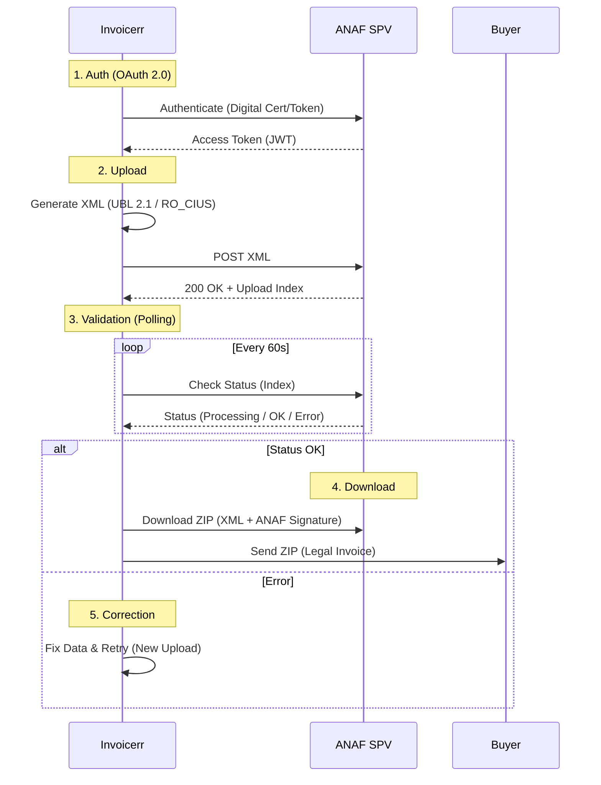

# 🇷🇴 Romania - Invoicing Specifications (RO e-Factura)

**Status:** 🔴 **Mandatory Clearance (B2B / B2G / B2C)**
**Authority:** ANAF (Agenția Națională de Administrare Fiscală)
**Platform:** **SPV** (Spațiul Privat Virtual) / **RO e-Factura**

---

## 1. Context & Roadmap

Romania has implemented a full **Clearance** system to combat VAT fraud. The system is mandatory for **all** invoices issued by companies with a Romanian VAT ID (including non-resident VAT payers).

| Date | Scope | Obligation |
| --- | --- | --- |
| **Active** | **B2G** | Mandatory. |
| **Active** | **B2B** | Mandatory. No paper invoices allowed. |
| **Active** | **B2C** | Mandatory reporting. |
| **Jan 1, 2026** | **Updates** | **5 Working Days** transmission deadline (changed from calendar days). See §4 for the legal basis. |

---

## 2. Technical Workflow (SPV & OAuth)

Invoicerr must act as an automated client uploading to the SPV platform.

### 🧱 Key Components

1. **RO_CIUS:** The national specification of EN 16931. Strict rules on VAT breakdown and units of measure.
2. **SPV (Virtual Private Space):** The portal. Access requires a **Qualified Digital Certificate** (hardware or cloud) to generate the initial OAuth token.
3. **ANAF Signature:** The final proof of validity. The legal invoice is the **ZIP file** returned by ANAF containing the XML and the official signature.

---

## 3. Data Standards & Requirements

### A. Format: `UBL 2.1` (RO_CIUS)

* **Syntax:** Standard UBL XML.
* **Constraints:**
* **VAT Breakdown:** Must perfectly match ANAF's calculation logic (strict rounding).
* **Units:** Must use UN/ECE codes (e.g., `H87` for piece, `HUR` for hour).
* **Supplier ID:** Must use the Romanian `CUI` (VAT number without RO prefix if non-payer, with RO if payer).

### B. Business Rules

* **B2G Reference:** `BT-13` (Purchase Order Reference) is mandatory for public sector invoices to ensure payment via *ForexeBug* (Treasury system).
* **B2C:** Must report sales to individuals. If `CNP` (Personal ID) is provided, it must be included.

---

## 4. Transmission Deadline

* **New Rule (from Jan 1, 2026):** Invoices must be transmitted within **5 working days** (*zile lucrătoare*) of issuance, no later than 5 working days after the statutory issuance deadline (Codul fiscal art. 319 §16). This replaces the **calendar-day** deadline (*zile calendaristice*) that had applied to the permanent B2B mandate since July 1, 2024.
* **Legal basis (verified verbatim, primary text):** OUG (Emergency Government Ordinance) no. 89/2025 of December 23, 2025 (Monitorul Oficial no. 1,203 of December 24, 2025), Art. X point 2, rewrites art. 10 §7 of OUG 120/2021: *"Termenul-limită pentru transmiterea facturilor în sistemul naţional privind factura electronică RO e-Factura este de 5 zile lucrătoare de la data emiterii facturii, dar nu mai târziu de 5 zile lucrătoare de la data-limită pentru emiterea facturii prevăzută la art. 319 alin. (16) din Legea nr. 227/2015..."* Entry into force is explicit in the same OUG, Art. XIV §1: *"Prevederile art. X pct. 1-3 [...] intră în vigoare la data de 1 ianuarie 2026."* Read directly (curl + `pdftotext -layout`) from `https://static.anaf.ro/static/10/Anaf/legislatie/OUG_89_2025.pdf` (HTTP 200), 2026-09-05. No later 2026 text amends this point (checked OUG 9/2026, OUG 13/2026, OUG 38/2026, and Legea 43/2026, which all cite OUG 89/2025 but only for other articles).
* **Note for maintainers:** an earlier compliance-catalog reading (`backend/src/modules/documents/country-policy/data/ro.json`, lot 7, 2026-09-05) flagged this claim as uncorroborated after reading OUG 120/2021, Legea 296/2023, OUG 115/2023, OUG 69/2024, OUG 156/2024, and OUG 21/2025 — none of which mention it. That reading stopped short of OUG 89/2025 (published a week after the ones it checked). The signal has since been resolved in that same data file: this claim stands confirmed.
* **Sanctions:** Fines range from 1,000 to 10,000 RON depending on company size. Non-transmitted invoices are **non-deductible** for the buyer.

---

## 5. Implementation Checklist

* [ ] **OAuth 2.0:** Implement the authentication flow. *Note: The initial setup requires a physical token or e-Token to register the application.*
* [ ] **Polling Engine:** Build a robust background worker to check the status of uploaded invoices (asynchronous processing).
* [ ] **ZIP Storage:** Store the **response ZIP** from ANAF. This is the legal original, not the XML you sent.
* [ ] **Unit Mapping:** Create a mapping table between Invoicerr's internal units and UN/ECE codes (H87, etc.).
* [ ] **ForexeBug Logic:** For B2G invoices, force the user to input the "Engagement/PO Number".

---

## 6. Resources

* **Official Portal:** [ANAF SPV](https://pfinternet.anaf.ro/)
* **Technical Specs:** [RO e-Factura Registry](https://www.google.com/search?q=https://mfinante.gov.ro/ro/web/etax/ro-efactura)
* **Validator:** [DUK Integrator](https://www.google.com/search?q=https://static.anaf.ro/static/10/Anaf/Declaratii_R/Aplicatii_dec/DUKIntegrator.htm)
