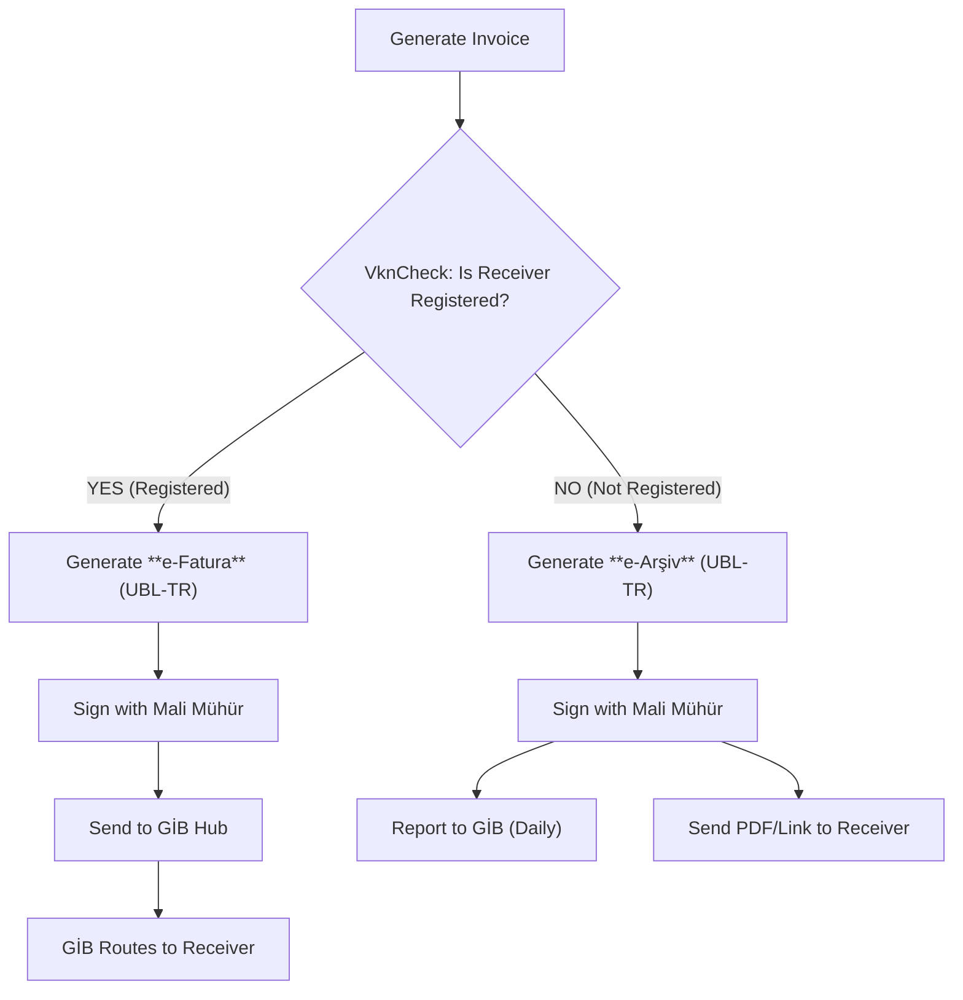

# 🇹🇷 Turkey - Invoicing Specifications (GİB e-Fatura / e-Arşiv)

**Status:** 🔴 **Mandatory Clearance**
**Authority:** GİB (Gelir İdaresi Başkanlığı)
**System:** **e-Belge** (e-Document)

---

## 1. Context & Roadmap

Turkey has one of the most mature **Clearance** systems. Invoicing is divided into two distinct flows based on the recipient's status.
**Crucial Rule:** You **must** check if the recipient is registered in the system before generating the invoice.

| Date | Scope | Obligation |
| --- | --- | --- |
| **Active** | **e-Fatura** | Mandatory B2B if recipient is registered. |
| **Active** | **e-Arşiv** | Mandatory for B2C, Export, and non-registered B2B > 2000 TL. |
| **Jan 1, 2026** | **Paper Ban** | Zero tolerance for paper invoices for most taxpayers. |

---

## 2. Technical Workflow (Dynamic Routing)

The workflow is conditional. Invoicerr must decide the path.

### 🧱 Key Components

1. **VknCheck (VKN Query):** API call to check if the client's Tax ID (VKN) is in the GİB registry.
2. **e-Fatura:** A closed-loop invoice sent *via* the GİB to another registered user. **Receiver can Reject (RED) or Accept (KABUL).**
3. **e-Arşiv:** An open-loop invoice sent *directly* to the client (email/SMS). You report a summary to GİB.
4. **Mali Mühür:** The "Financial Seal" (Certificate) used to sign the XML. For cloud apps, this is usually delegated to an Integrator's HSM.

---

## 3. Data Standards & Scenarios

### A. Format: `UBL-TR 1.2`

* **Syntax:** UBL 2.1 customized for Turkey.
* **Constraints:** Strict Schematron validation (math, tax codes).

### B. Scenarios (ProfileID)

You must select the correct profile:

* `TICARIFATURA` (Commercial): Receiver can Accept/Reject within 8 days. Standard B2B.
* `TEMELFATURA` (Basic): Receiver cannot reject via system (must use external notary/KEP).
* `IHRACAT` (Export): For customs. Receiver is the Ministry of Customs (GTB).
* `KAMU` (Public): For B2G. Linked to public spending system.

---

## 4. Implementation Checklist

* [ ] **VknCheck Logic:** **CRITICAL.** Before saving an invoice, query the GİB/Integrator API with the client's VKN.
* If `True` -> Force `e-Fatura` mode.
* If `False` -> Force `e-Arşiv` mode.

* [ ] **Integrator Connection:** Connect to a certified private integrator (e.g., Sovos, Logo, Digital Planet). Direct connection to GİB is too complex for SaaS.
* [ ] **Profile Selector:** Allow user to choose `TICARI` vs `TEMEL`.
* [ ] **Export Logic:** If `ProfileID` = `IHRACAT`, ensure GTIP codes (HS Codes) and package info are present.
* [ ] **QR Code:** Generate the mandatory QR code on the PDF (for e-Arşiv).

---

## 5. Resources

* **Official Portal:** [e-Belge GİB](https://ebelge.gib.gov.tr/)
* **Technical Guide:** [UBL-TR Guides](https://www.google.com/search?q=https://ebelge.gib.gov.tr/dosyalar/kilavuzlar/UBL-TR_1.2_Klavuzlari.zip)
* **Test Portal:** [e-Fatura Test](https://www.google.com/search?q=https://efatura-test.gib.gov.tr/)

