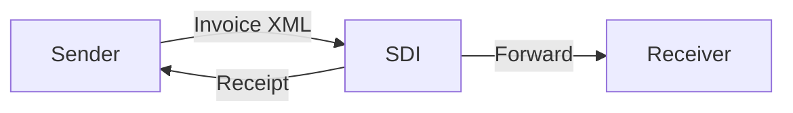

# SDI Setup Guide

**SDI** (Sistema di Interscambio) is the Italian national e-invoicing system managed by the Italian Revenue Agency (Agenzia delle Entrate). All invoices issued in Italy must be transmitted through SDI.

Follow the steps below to obtain the credentials needed to connect Invoicerr to SDI.

---

## 1. Obtain your Italian VAT number (Partita IVA)

Your company must have an Italian **Partita IVA** (VAT number).

- If you are registered for VAT in Italy, your Partita IVA is your 11-digit tax ID.
- Foreign companies must register for a direct Italian VAT number or appoint a **fiscal representative** (rappresentante fiscale) in Italy.

---

## 2. Choose your SDI channel

SDI supports several transmission channels. Choose the one that fits your setup:

| Channel | Description |
|---------|-------------|
| **PEC** (Certified Email) | Send and receive invoices via a certified email address. Simplest option. |
| **Web service** (API) | Direct API integration with SDI for automated transmission. Recommended for Invoicerr. |
| **FTP/SFTP** | File-based exchange with SDI servers. |
| **SDICoop** | Lightweight client provided by the Revenue Agency. |

For Invoicerr integration, the **Web service (API)** channel is recommended.

---

## 3. Obtain SDI API credentials

To use the SDI web service API:

1. Go to the **Fattura Elettronica** portal: [https://fatturaelettronica.agenziaentrate.gov.it](https://fatturaelettronica.agenziaentrate.gov.it)
2. Log in with your **SPID**, **CIE**, or **CNS** digital identity.
3. Navigate to **Servizi → Ricezione fatture** (Invoice reception).
5. Register your **SDI channel**:
   - If using **PEC**: register your certified email address.
   - If using **API**: request an **authorisation token** or **client certificate**.
6. Download the credentials (token or certificate file).

---

## 4. Understand the SDI invoice flow

SDI acts as a relay — it does not validate invoice content but verifies the format and routes the invoice to the recipient:

Invoice lifecycle:
1. You send an XML invoice to SDI via your chosen channel.
2. SDI sends back a **ricevuta** (receipt): `Consegnato` (delivered) or `Scartato` (rejected).
3. SDI forwards the invoice to the recipient's SDI channel.
4. The recipient can accept or reject the invoice.

---

## 5. Connect Invoicerr to SDI

Once you have your credentials, configure the SDI channel in Invoicerr:

1. Go to **Settings → E-invoicing**.
2. Click **Connect** on the SDI card.
3. Fill in:
   - **Partita IVA** — your Italian VAT number
   - **Channel type** — `PEC` or `API`
   - **Credentials** — PEC address or API token / certificate
   - **Environment** — `TEST` or `PRODUCTION`
4. Save the configuration.

Invoicerr will use these credentials to authenticate with the SDI system and transmit invoices on your behalf.

---

## Additional resources

- [Fattura Elettronica official portal](https://fatturaelettronica.agenziaentrate.gov.it)
- [SDI technical specifications](https://www.agenziaentrate.gov.it/portale/web/guest/specifiche-tecniche-fattura-elettronica)
