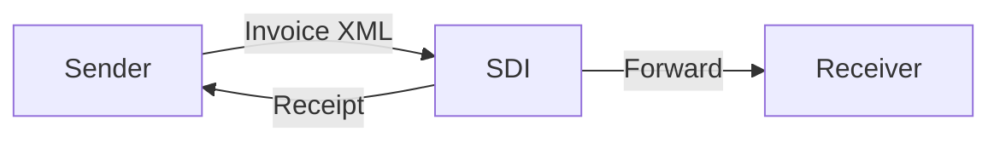

# SDI Setup Guide

**SDI** (Sistema di Interscambio) is the Italian national e-invoicing system managed by the Italian Revenue Agency (Agenzia delle Entrate). All invoices issued in Italy must be transmitted through SDI.

Follow the steps below to obtain the credentials needed to connect Invoicerr to SDI.

---

## 1. Obtain your Italian VAT number (Partita IVA)

Your company must have an Italian **Partita IVA** (VAT number).

- If you are registered for VAT in Italy, your Partita IVA is your 11-digit tax ID.
- Foreign companies must register for a direct Italian VAT number or appoint a **fiscal representative** (rappresentante fiscale) in Italy.

---

## 2. Choose your SDI channel

SDI supports several transmission channels in general — **PEC** (certified email), a **web service
(API)**, **FTP/SFTP**, and the Revenue Agency's own **SdICoop** client. Invoicerr implements exactly
one of these: **SdICoop**, the SOAP web-service channel. There is no PEC, FTP, or generic-API option
in Invoicerr's own SDI connection form — if you want to use this integration, register the SdICoop
channel with the Revenue Agency.

---

## 3. Obtain SDI API credentials

To use the SDI web service API:

1. Go to the **Fattura Elettronica** portal: [https://fatturaelettronica.agenziaentrate.gov.it](https://fatturaelettronica.agenziaentrate.gov.it)
2. Log in with your **SPID**, **CIE**, or **CNS** digital identity.
3. Navigate to **Servizi → Ricezione fatture** (Invoice reception) and accredit for the **SdICoop**
   web-service channel — the one Invoicerr implements (see step 2 above).
4. Get accredited as an intermediary and obtain:
   - your **IdTrasmittente** (transmitter ID),
   - the **SdIRiceviFile** endpoint URL the Agency hands your accredited account,
   - a **PFX client certificate** (and its password) for that channel.

---

## 4. Understand the SDI invoice flow

SDI acts as a relay — it does not validate invoice content but verifies the format and routes the invoice to the recipient:

```mermaid
flowchart LR
  Sender -->|Invoice XML| SDI
  SDI -->|Forward| Receiver
  SDI -->|Receipt| Sender
```

Invoice lifecycle:
1. You send an XML invoice to SDI via your chosen channel.
2. SDI sends back a **ricevuta** (receipt): `Consegnato` (delivered) or `Scartato` (rejected).
3. SDI forwards the invoice to the recipient's SDI channel.
4. The recipient can accept or reject the invoice.

---

## 5. Connect Invoicerr to SDI

Once you have your credentials, configure the SDI channel in Invoicerr:

1. Go to **Settings → E-invoicing → Channels**.
2. Click **Connect** on the SDI card.
3. Fill in the four fields this channel actually asks for:
   - **IdTrasmittente** — your transmitter ID from step 3 above
   - **SdIRiceviFile endpoint URL** — the exact URL the Revenue Agency handed your accredited account
   - **PFX certificate (base64)** — your SdICoop client certificate
   - **Certificate password** — optional; a real PFX can legitimately carry an empty one
   - **Environment** — `TEST` or `PRODUCTION` (the same selector every channel offers)
4. Save the configuration.

This module is implemented but, as of this writing, has never been run against SdI's real
production endpoint — see the accreditation note above and "Known limitation" below before relying
on it for a live invoice.

Invoicerr will use these credentials to authenticate with the SDI system and transmit invoices on your behalf.

---

---

## Known limitation — the recipient's routing code

SDI routes an invoice to its recipient using a **Codice Destinatario**: seven characters for an
ordinary business, six for a public administration (the *Codice Univoco Ufficio*, looked up from
IndicePA), or a **PEC** address instead.

Invoicerr can record that code for a client marked as a **government** buyer, because the Italian B2G
routing rule asks for it. It currently offers **no field to record it for an ordinary business
client**. An invoice to such a client is therefore sent with the placeholder reserved for recipients
without an Italian routing code, which is not what a domestic Italian recipient should receive.

Until that field exists, an Italian seller invoicing another Italian business should expect SDI
delivery to that recipient to be unreliable, and should not rely on this path for production
invoicing.

---

## Additional resources

- [Fattura Elettronica official portal](https://fatturaelettronica.agenziaentrate.gov.it)
- [SDI technical specifications](https://www.agenziaentrate.gov.it/portale/web/guest/specifiche-tecniche-fattura-elettronica)
